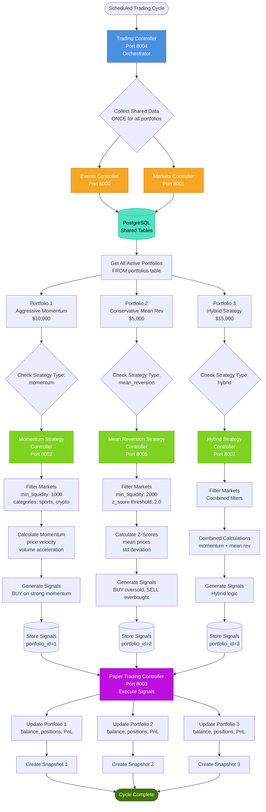
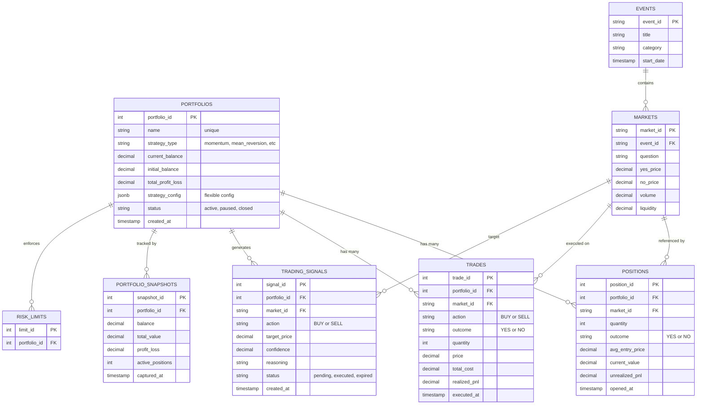
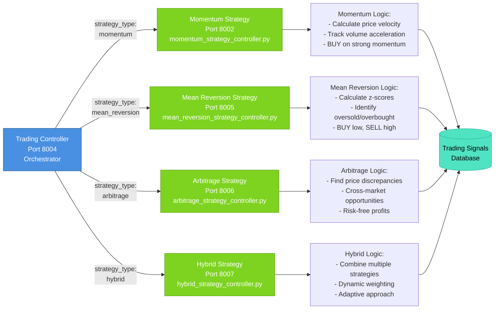
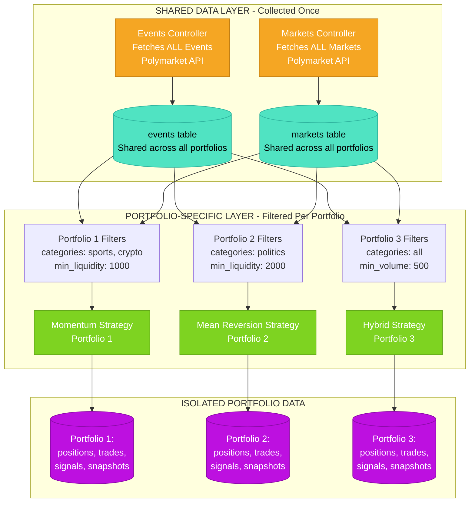
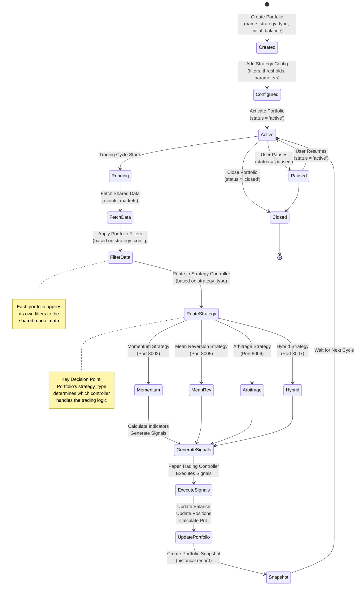

# Multiple Portfolio Migration Plan - Portfolio-Centric Architecture

## Executive Summary

This document provides an implementation guide for expanding Prescient OS to support multiple portfolios with independent trading strategies and P&L tracking. The Portfolio-Centric Architecture approach provides true isolation between portfolios, enabling:

- **Multiple concurrent strategies** running independently
- **Separate capital allocation** per portfolio
- **Independent P&L tracking** without cross-contamination
- **Strategy comparison** and A/B testing
- **Scalable architecture** for professional trading operations

**Implementation Complexity**: Medium
**Estimated Timeline**: 2-3 weeks
**Business Value**: Very High

## Migration Strategy

**DECISION: Drop and Rebuild Database**

Since this is a fundamental architecture change and we don't need to preserve existing data, we'll:
1. Create a completely new schema with portfolio support built-in
2. Drop the old database locally
3. Create fresh database with new schema
4. Commit schema changes to git with clear commit message

**Why no migration script?**
- No production data to preserve
- Fundamental paradigm shift (single → multi-portfolio)
- Simpler and faster implementation
- Old schema is preserved in git history
- Reduces complexity and testing burden

---

## Table of Contents

1. [Current System Analysis](#current-system-analysis)
2. [Portfolio-Centric Architecture Overview](#portfolio-centric-architecture-overview)
3. [New Database Schema](#new-database-schema)
4. [Database Operations Layer Changes](#database-operations-layer-changes)
5. [Controller Architecture Changes](#controller-architecture-changes)
6. [Price Updater Modifications](#price-updater-modifications)
7. [Trading Cycle Orchestration](#trading-cycle-orchestration)
8. [Implementation Guide](#implementation-guide) ⭐ **Start Here**
9. [Testing Strategy](#testing-strategy)
10. [API Documentation](#api-documentation)
11. [Performance Considerations](#performance-considerations)
12. [Risk Management](#risk-management)

---

## Current System Analysis

### Architecture Constraints

The current system has the following limitations:

1. **Single Portfolio State** (`portfolio_state` table)
   - Single row with `id = 1`
   - Global balance: $10,000 initial
   - All trades share same capital pool
   - Location: `src/db/operations.py:32-68`

2. **No Portfolio Context in Data**
   - `portfolio_positions` table: no portfolio FK
   - `trades` table: no portfolio FK
   - `trading_signals` table: no portfolio FK
   - All queries return data without portfolio filtering

3. **Single Strategy Controller** (Port 8002)
   - Generates signals for all filtered markets
   - No strategy differentiation
   - Cannot run multiple strategies concurrently

4. **Global Price Updater**
   - Updates ALL open positions every 5 minutes
   - No portfolio-level filtering
   - Location: `src/paper_trading_controller.py:20-35`

### Current Trading Flow

```
Events Controller (8000)
    ↓ Export & Filter Events
Markets Controller (8001)
    ↓ Export & Filter Markets
Strategy Controller (8002)
    ↓ Generate Signals
Paper Trading Controller (8003)
    ↓ Execute Trades → Update Portfolio State (id=1)
    ↓ Price Updater (Background) → Update All Positions
Trading Controller (8004)
    ↓ Create Daily Snapshot
```

This flow must be adapted to support portfolio-specific execution while maintaining the same orchestration pattern.

---

## Portfolio-Centric Architecture Overview

### Core Concept

Replace the single `portfolio_state` table with a `portfolios` table that supports multiple portfolio instances. Each portfolio:

- Has its own balance and capital allocation
- Links to positions and trades via `portfolio_id` foreign key
- Has strategy configuration stored in JSONB field
- Operates independently from other portfolios
- Can be paused, archived, or rebalanced individually

### Key Design Principles

1. **True Isolation**: Each portfolio is completely independent
2. **Backward Compatibility**: Migrate existing data to "Default Portfolio"
3. **Strategy Flexibility**: Support both single controller and multi-controller approaches
4. **Performance**: Use database indexes for fast portfolio-filtered queries
5. **Scalability**: Design supports 100+ portfolios without architectural changes

---

## New Database Schema

### Core Tables

All tables are designed with portfolio support from the start. No migration needed - just drop and rebuild.

### Portfolios Table (replaces portfolio_state)

This is the central table that replaces `portfolio_state`:

```sql

CREATE TABLE portfolios (
    portfolio_id SERIAL PRIMARY KEY,

    -- Identity
    name VARCHAR(255) NOT NULL,
    description TEXT,
    strategy_type VARCHAR(100) NOT NULL,  -- 'momentum', 'mean_reversion', 'arbitrage', etc.

    -- Financial State
    initial_balance DECIMAL(15, 2) NOT NULL,
    current_balance DECIMAL(15, 2) NOT NULL,
    total_invested DECIMAL(15, 2) DEFAULT 0,
    total_profit_loss DECIMAL(15, 2) DEFAULT 0,
    trade_count INTEGER DEFAULT 0,

    -- Status
    status VARCHAR(50) DEFAULT 'active',  -- 'active', 'paused', 'archived'
    created_at TIMESTAMP DEFAULT NOW(),
    last_updated TIMESTAMP DEFAULT NOW(),

    -- Strategy Configuration (flexible JSONB for strategy-specific params)
    strategy_config JSONB DEFAULT '{}'::jsonb,

    -- Performance Tracking (denormalized for fast queries)
    total_trades_executed INTEGER DEFAULT 0,
    total_winning_trades INTEGER DEFAULT 0,
    total_losing_trades INTEGER DEFAULT 0,
    avg_trade_pnl DECIMAL(15, 2) DEFAULT 0,
    max_drawdown DECIMAL(15, 2) DEFAULT 0,

    -- Metadata
    last_trade_at TIMESTAMP,
    last_price_update TIMESTAMP,

    UNIQUE(name)
);

-- Indexes for performance
CREATE INDEX idx_portfolios_status ON portfolios(status);
CREATE INDEX idx_portfolios_strategy_type ON portfolios(strategy_type);
CREATE INDEX idx_portfolios_status_strategy ON portfolios(status, strategy_type);
```

**Strategy Config Example**:

```json
{
    "min_confidence": 0.75,
    "market_types": ["politics", "crypto"],
    "min_liquidity": 50000,
    "min_volume": 100000
}
```

### Portfolio Positions Table

```sql
CREATE TABLE portfolio_positions (
    id SERIAL PRIMARY KEY,
    portfolio_id INTEGER NOT NULL,
    trade_id VARCHAR(255) NOT NULL,
    market_id VARCHAR(255) NOT NULL,
    market_question TEXT,
    action VARCHAR(50) NOT NULL,
    amount DECIMAL(15, 2) NOT NULL,
    entry_price DECIMAL(10, 4) NOT NULL,
    entry_timestamp TIMESTAMP NOT NULL,
    status VARCHAR(50) NOT NULL,
    current_pnl DECIMAL(15, 2) DEFAULT 0,
    realized_pnl DECIMAL(15, 2),
    exit_price DECIMAL(10, 4),
    exit_timestamp TIMESTAMP,

    -- Foreign key constraint
    CONSTRAINT fk_portfolio_positions_portfolio
        FOREIGN KEY (portfolio_id) REFERENCES portfolios(portfolio_id)
        ON DELETE CASCADE
);

-- Indexes
CREATE INDEX idx_portfolio_positions_portfolio_id ON portfolio_positions(portfolio_id);
CREATE INDEX idx_portfolio_positions_portfolio_status ON portfolio_positions(portfolio_id, status);
CREATE INDEX idx_portfolio_positions_portfolio_market ON portfolio_positions(portfolio_id, market_id);
```

### Trades Table

```sql
CREATE TABLE trades (
    id SERIAL PRIMARY KEY,
    portfolio_id INTEGER NOT NULL,
    trade_id VARCHAR(255) NOT NULL,
    timestamp TIMESTAMP NOT NULL,
    market_id VARCHAR(255) NOT NULL,
    market_question TEXT,
    action VARCHAR(50) NOT NULL,
    amount DECIMAL(15, 2) NOT NULL,
    entry_price DECIMAL(10, 4) NOT NULL,
    confidence DECIMAL(5, 4),
    reason TEXT,
    status VARCHAR(50) NOT NULL,
    event_id VARCHAR(255),
    event_title TEXT,
    event_end_date TIMESTAMP,
    current_pnl DECIMAL(15, 2) DEFAULT 0,
    realized_pnl DECIMAL(15, 2),

    -- Foreign key constraint
    CONSTRAINT fk_trades_portfolio
        FOREIGN KEY (portfolio_id) REFERENCES portfolios(portfolio_id)
        ON DELETE CASCADE
);

-- Indexes
CREATE INDEX idx_trades_portfolio_id ON trades(portfolio_id);
CREATE INDEX idx_trades_portfolio_timestamp ON trades(portfolio_id, timestamp);
CREATE INDEX idx_trades_portfolio_status ON trades(portfolio_id, status);
```

### Trading Signals Table

```sql
CREATE TABLE trading_signals (
    id SERIAL PRIMARY KEY,
    portfolio_id INTEGER NOT NULL,
    strategy_type VARCHAR(100) NOT NULL,
    timestamp TIMESTAMP NOT NULL,
    market_id VARCHAR(255) NOT NULL,
    market_question TEXT,
    action VARCHAR(50) NOT NULL,
    target_price DECIMAL(10, 4),
    amount DECIMAL(15, 2),
    confidence DECIMAL(5, 4),
    reason TEXT,
    yes_price DECIMAL(10, 4),
    no_price DECIMAL(10, 4),
    market_liquidity DECIMAL(15, 2),
    market_volume DECIMAL(15, 2),
    event_id VARCHAR(255),
    event_title TEXT,
    event_end_date TIMESTAMP,
    executed BOOLEAN DEFAULT FALSE,
    executed_at TIMESTAMP,
    trade_id VARCHAR(255),

    -- Foreign key constraint
    CONSTRAINT fk_trading_signals_portfolio
        FOREIGN KEY (portfolio_id) REFERENCES portfolios(portfolio_id)
        ON DELETE CASCADE
);

-- Indexes
CREATE INDEX idx_trading_signals_portfolio ON trading_signals(portfolio_id);
CREATE INDEX idx_trading_signals_portfolio_executed ON trading_signals(portfolio_id, executed);
CREATE INDEX idx_trading_signals_strategy ON trading_signals(strategy_type);
```

### Portfolio History Table

```sql
CREATE TABLE portfolio_history (
    id SERIAL PRIMARY KEY,
    portfolio_id INTEGER NOT NULL,
    snapshot_date DATE NOT NULL,
    timestamp TIMESTAMP NOT NULL,
    balance DECIMAL(15, 2) NOT NULL,
    total_invested DECIMAL(15, 2) NOT NULL,
    total_profit_loss DECIMAL(15, 2) NOT NULL,
    total_value DECIMAL(15, 2) NOT NULL,
    open_positions INTEGER DEFAULT 0,
    trade_count INTEGER DEFAULT 0,

    -- Foreign key constraint
    CONSTRAINT fk_portfolio_history_portfolio
        FOREIGN KEY (portfolio_id) REFERENCES portfolios(portfolio_id)
        ON DELETE CASCADE,

    -- Unique constraint to prevent duplicate snapshots
    UNIQUE(portfolio_id, snapshot_date)
);

-- Indexes
CREATE INDEX idx_portfolio_history_portfolio_date ON portfolio_history(portfolio_id, snapshot_date);
CREATE INDEX idx_portfolio_history_portfolio_timestamp ON portfolio_history(portfolio_id, timestamp);
```

### Future Enhancement Tables (Optional - Don't Implement Unless You Are Specifically Told to)

#### 3.1 Create `portfolio_rebalancing_log`

Track capital movements between portfolios:

```sql
CREATE TABLE portfolio_rebalancing_log (
    id SERIAL PRIMARY KEY,
    timestamp TIMESTAMP DEFAULT NOW(),
    from_portfolio_id INTEGER REFERENCES portfolios(portfolio_id),
    to_portfolio_id INTEGER REFERENCES portfolios(portfolio_id),
    amount DECIMAL(15, 2) NOT NULL,
    reason TEXT,
    executed_by VARCHAR(100),  -- 'system' or 'manual'

    CONSTRAINT positive_amount CHECK (amount > 0)
);

CREATE INDEX idx_rebalancing_from_portfolio ON portfolio_rebalancing_log(from_portfolio_id);
CREATE INDEX idx_rebalancing_to_portfolio ON portfolio_rebalancing_log(to_portfolio_id);
CREATE INDEX idx_rebalancing_timestamp ON portfolio_rebalancing_log(timestamp);
```

#### 3.2 Create `portfolio_performance_cache`

Cache expensive performance calculations:

```sql
CREATE TABLE portfolio_performance_cache (
    portfolio_id INTEGER PRIMARY KEY REFERENCES portfolios(portfolio_id) ON DELETE CASCADE,
    calculated_at TIMESTAMP DEFAULT NOW(),

    -- Performance Metrics
    sharpe_ratio DECIMAL(10, 4),
    sortino_ratio DECIMAL(10, 4),
    win_rate DECIMAL(5, 2),
    avg_win DECIMAL(15, 2),
    avg_loss DECIMAL(15, 2),
    profit_factor DECIMAL(10, 4),
    max_consecutive_wins INTEGER,
    max_consecutive_losses INTEGER,

    -- Time-based Returns
    return_1d DECIMAL(10, 4),
    return_7d DECIMAL(10, 4),
    return_30d DECIMAL(10, 4),
    return_all_time DECIMAL(10, 4)
);
```

---

## Database Operations Layer Changes

All functions in `src/db/operations.py` need to be updated to support portfolio context.

### Pattern 1: Add Optional `portfolio_id` Parameter

For functions that currently operate globally, add optional `portfolio_id`:

```python
# OLD - operates on single portfolio
def get_portfolio_state() -> Dict:
    with get_db() as db:
        result = db.execute(text("""
            SELECT balance, total_invested, total_profit_loss, trade_count
            FROM portfolio_state WHERE id = 1
        """)).fetchone()
        # ...

# NEW - operates on specific or default portfolio
def get_portfolio_state(portfolio_id: int = None) -> Dict:
    """
    Get portfolio state for specific portfolio or default if not specified

    Args:
        portfolio_id: Portfolio ID (defaults to first active portfolio)

    Returns:
        Portfolio state dictionary
    """
    if portfolio_id is None:
        # Get first active portfolio as default
        portfolio_id = _get_default_portfolio_id()

    with get_db() as db:
        result = db.execute(text("""
            SELECT portfolio_id, name, description, strategy_type,
                   initial_balance, current_balance, total_invested,
                   total_profit_loss, trade_count, status, created_at,
                   last_updated, strategy_config
            FROM portfolios
            WHERE portfolio_id = :portfolio_id
        """), {'portfolio_id': portfolio_id}).fetchone()

        if not result:
            raise ValueError(f"Portfolio {portfolio_id} not found")

        return {
            'portfolio_id': result[0],
            'name': result[1],
            'description': result[2],
            'strategy_type': result[3],
            'initial_balance': float(result[4]),
            'current_balance': float(result[5]),
            'total_invested': float(result[6]),
            'total_profit_loss': float(result[7]),
            'trade_count': int(result[8]),
            'status': result[9],
            'created_at': result[10],
            'last_updated': result[11],
            'strategy_config': result[12] or {}
        }
```

### Pattern 2: Helper Function for Default Portfolio

```python
def _get_default_portfolio_id() -> int:
    """
    Get the default portfolio ID (first active portfolio)
    Used for backward compatibility when portfolio_id not specified
    """
    with get_db() as db:
        result = db.execute(text("""
            SELECT portfolio_id FROM portfolios
            WHERE status = 'active'
            ORDER BY portfolio_id ASC
            LIMIT 1
        """)).fetchone()

        if not result:
            raise ValueError("No active portfolios found")

        return int(result[0])
```

### Complete Function Updates

#### Portfolio Operations

```python
# ============================================================================
# PORTFOLIO OPERATIONS
# ============================================================================

def create_portfolio(portfolio_data: Dict) -> int:
    """
    Create a new portfolio

    Args:
        portfolio_data: Dictionary with portfolio configuration

    Returns:
        Created portfolio_id

    Example:
        portfolio_id = create_portfolio({
            'name': 'Momentum Strategy',
            'description': 'High-confidence momentum trades',
            'strategy_type': 'momentum',
            'initial_balance': 50000,
            'current_balance': 50000,
            'strategy_config': {
                'min_confidence': 0.80,
                'market_types': ['politics']
            }
        })
    """
    with get_db() as db:
        result = db.execute(text("""
            INSERT INTO portfolios
            (name, description, strategy_type, initial_balance, current_balance,
             strategy_config, status)
            VALUES (:name, :description, :strategy_type, :initial_balance, :current_balance,
                    CAST(:strategy_config AS jsonb), 'active')
            RETURNING portfolio_id
        """), {
            'name': portfolio_data['name'],
            'description': portfolio_data.get('description', ''),
            'strategy_type': portfolio_data['strategy_type'],
            'initial_balance': portfolio_data['initial_balance'],
            'current_balance': portfolio_data.get('current_balance', portfolio_data['initial_balance']),
            'strategy_config': json.dumps(portfolio_data.get('strategy_config', {}))
        })
        portfolio_id = result.scalar_one()
        db.commit()
        logger.info(f"Created portfolio {portfolio_id}: {portfolio_data['name']}")
        return int(portfolio_id)


def get_all_portfolios(status: str = None) -> List[Dict]:
    """
    Get all portfolios, optionally filtered by status

    Args:
        status: Filter by status ('active', 'paused', 'archived'), or None for all

    Returns:
        List of portfolio dictionaries
    """
    with get_db() as db:
        query = """
            SELECT portfolio_id, name, description, strategy_type,
                   initial_balance, current_balance, total_invested,
                   total_profit_loss, trade_count, status, created_at,
                   last_updated, strategy_config
            FROM portfolios
        """

        params = {}
        if status:
            query += " WHERE status = :status"
            params['status'] = status

        query += " ORDER BY portfolio_id ASC"

        results = db.execute(text(query), params).fetchall()

        portfolios = []
        for row in results:
            portfolios.append({
                'portfolio_id': row[0],
                'name': row[1],
                'description': row[2],
                'strategy_type': row[3],
                'initial_balance': float(row[4]),
                'current_balance': float(row[5]),
                'total_invested': float(row[6]),
                'total_profit_loss': float(row[7]),
                'trade_count': int(row[8]),
                'status': row[9],
                'created_at': row[10],
                'last_updated': row[11],
                'strategy_config': row[12] or {}
            })

        return portfolios


def update_portfolio(portfolio_id: int, updates: Dict):
    """
    Update portfolio fields

    Args:
        portfolio_id: Portfolio to update
        updates: Dictionary of fields to update

    Example:
        update_portfolio(1, {
            'current_balance': 9500.00,
            'total_invested': 500.00,
            'trade_count': 1,
            'status': 'active'
        })
    """
    with get_db() as db:
        # Build SET clause dynamically from updates dict
        set_clauses = [f"{key} = :{key}" for key in updates.keys()]
        set_clauses.append("last_updated = NOW()")
        set_clause = ", ".join(set_clauses)

        query = f"""
            UPDATE portfolios
            SET {set_clause}
            WHERE portfolio_id = :portfolio_id
        """

        updates['portfolio_id'] = portfolio_id

        # Handle JSONB fields
        if 'strategy_config' in updates and isinstance(updates['strategy_config'], dict):
            updates['strategy_config'] = json.dumps(updates['strategy_config'])

        db.execute(text(query), updates)
        db.commit()
        logger.debug(f"Updated portfolio {portfolio_id}: {list(updates.keys())}")


def pause_portfolio(portfolio_id: int, reason: str = None):
    """Pause a portfolio (stop trading but keep data)"""
    update_portfolio(portfolio_id, {'status': 'paused'})
    logger.info(f"Paused portfolio {portfolio_id}: {reason}")


def archive_portfolio(portfolio_id: int, reason: str = None):
    """Archive a portfolio (historical data only, no trading)"""
    update_portfolio(portfolio_id, {'status': 'archived'})
    logger.info(f"Archived portfolio {portfolio_id}: {reason}")


def delete_portfolio(portfolio_id: int):
    """
    Delete a portfolio and all associated data (CASCADE)
    WARNING: This is destructive and permanent
    """
    with get_db() as db:
        db.execute(text("""
            DELETE FROM portfolios WHERE portfolio_id = :portfolio_id
        """), {'portfolio_id': portfolio_id})
        db.commit()
        logger.warning(f"DELETED portfolio {portfolio_id} and all associated data")
```

#### Position Operations

```python
def get_portfolio_positions(portfolio_id: int, status: str = 'open') -> List[Dict]:
    """
    Get positions for specific portfolio

    Args:
        portfolio_id: Portfolio to query
        status: Position status filter ('open', 'closed')

    Returns:
        List of position dictionaries
    """
    with get_db() as db:
        results = db.execute(text("""
            SELECT trade_id, market_id, market_question, action, amount,
                   entry_price, entry_timestamp, status, current_pnl,
                   realized_pnl, exit_price, exit_timestamp
            FROM portfolio_positions
            WHERE portfolio_id = :portfolio_id AND status = :status
            ORDER BY entry_timestamp DESC
        """), {'portfolio_id': portfolio_id, 'status': status}).fetchall()

        positions = []
        for row in results:
            positions.append({
                'trade_id': row[0],
                'market_id': row[1],
                'market_question': row[2],
                'action': row[3],
                'amount': float(row[4]),
                'entry_price': float(row[5]),
                'entry_timestamp': row[6].isoformat() if row[6] else None,
                'status': row[7],
                'current_pnl': float(row[8]) if row[8] else 0.0,
                'realized_pnl': float(row[9]) if row[9] else None,
                'exit_price': float(row[10]) if row[10] else None,
                'exit_timestamp': row[11].isoformat() if row[11] else None
            })

        return positions


def add_portfolio_position(position: Dict, portfolio_id: int):
    """
    Add position to specific portfolio

    Args:
        position: Position data dictionary
        portfolio_id: Portfolio to add position to
    """
    with get_db() as db:
        db.execute(text("""
            INSERT INTO portfolio_positions
            (portfolio_id, trade_id, market_id, market_question, action, amount,
             entry_price, entry_timestamp, status, current_pnl)
            VALUES (:portfolio_id, :trade_id, :market_id, :market_question, :action,
                    :amount, :entry_price, :entry_timestamp, :status, :current_pnl)
        """), {
            'portfolio_id': portfolio_id,
            'trade_id': position['trade_id'],
            'market_id': position['market_id'],
            'market_question': position['market_question'],
            'action': position['action'],
            'amount': position['amount'],
            'entry_price': position['entry_price'],
            'entry_timestamp': position['entry_timestamp'],
            'status': position['status'],
            'current_pnl': position.get('current_pnl', 0.0)
        })
        db.commit()
```

#### Trade Operations

```python
def insert_trade(trade: Dict, portfolio_id: int):
    """
    Insert trade for specific portfolio

    Args:
        trade: Trade data dictionary
        portfolio_id: Portfolio executing the trade
    """
    with get_db() as db:
        db.execute(text("""
            INSERT INTO trades
            (portfolio_id, trade_id, timestamp, market_id, market_question, action,
             amount, entry_price, confidence, reason, status, event_id, event_title,
             event_end_date, current_pnl, realized_pnl)
            VALUES (:portfolio_id, :trade_id, :timestamp, :market_id, :market_question,
                    :action, :amount, :entry_price, :confidence, :reason, :status,
                    :event_id, :event_title, :event_end_date, :current_pnl, :realized_pnl)
        """), {
            'portfolio_id': portfolio_id,
            **trade
        })
        db.commit()


def get_trades(portfolio_id: int = None, limit: int = None, status: str = None) -> List[Dict]:
    """
    Get trades with optional portfolio filter

    Args:
        portfolio_id: Filter by portfolio (None = all portfolios)
        limit: Max number of trades to return
        status: Filter by status

    Returns:
        List of trade dictionaries
    """
    with get_db() as db:
        query = """
            SELECT portfolio_id, trade_id, timestamp, market_id, market_question,
                   action, amount, entry_price, confidence, reason, status,
                   event_id, event_title, event_end_date, current_pnl, realized_pnl
            FROM trades
        """

        params = {}
        where_clauses = []

        if portfolio_id is not None:
            where_clauses.append("portfolio_id = :portfolio_id")
            params['portfolio_id'] = portfolio_id

        if status:
            where_clauses.append("status = :status")
            params['status'] = status

        if where_clauses:
            query += " WHERE " + " AND ".join(where_clauses)

        query += " ORDER BY timestamp DESC"

        if limit:
            query += " LIMIT :limit"
            params['limit'] = limit

        results = db.execute(text(query), params).fetchall()

        trades = []
        for row in results:
            trades.append({
                'portfolio_id': row[0],
                'trade_id': row[1],
                'timestamp': row[2].isoformat() if row[2] else None,
                'market_id': row[3],
                'market_question': row[4],
                'action': row[5],
                'amount': float(row[6]),
                'entry_price': float(row[7]),
                'confidence': float(row[8]) if row[8] is not None else 0.0,
                'reason': row[9],
                'status': row[10],
                'event_id': row[11],
                'event_title': row[12],
                'event_end_date': row[13].isoformat() if row[13] else None,
                'current_pnl': float(row[14]) if row[14] else 0.0,
                'realized_pnl': float(row[15]) if row[15] else None
            })

        return trades
```

#### Signal Operations

```python
def insert_signal(signal: Dict, portfolio_id: int, strategy_type: str) -> int:
    """
    Insert signal for specific portfolio and strategy

    Args:
        signal: Signal data dictionary
        portfolio_id: Target portfolio
        strategy_type: Strategy that generated signal

    Returns:
        Inserted signal ID
    """
    with get_db() as db:
        result = db.execute(text("""
            INSERT INTO trading_signals
            (portfolio_id, strategy_type, timestamp, market_id, market_question,
             action, target_price, amount, confidence, reason, yes_price, no_price,
             market_liquidity, market_volume, event_id, event_title, event_end_date,
             executed, executed_at, trade_id)
            VALUES (:portfolio_id, :strategy_type, :timestamp, :market_id, :market_question,
                    :action, :target_price, :amount, :confidence, :reason, :yes_price,
                    :no_price, :market_liquidity, :market_volume, :event_id, :event_title,
                    :event_end_date, :executed, :executed_at, :trade_id)
            RETURNING id
        """), {
            'portfolio_id': portfolio_id,
            'strategy_type': strategy_type,
            **signal
        })
        inserted_id = result.scalar_one()
        db.commit()
        return int(inserted_id)


def get_current_signals(portfolio_id: int = None, executed: bool = False) -> List[Dict]:
    """
    Get signals with optional portfolio filter

    Args:
        portfolio_id: Filter by portfolio (None = all portfolios)
        executed: Filter by execution status

    Returns:
        List of signal dictionaries
    """
    with get_db() as db:
        query = """
            SELECT id, portfolio_id, strategy_type, timestamp, market_id, market_question,
                   action, target_price, amount, confidence, reason, yes_price, no_price,
                   market_liquidity, market_volume, event_id, event_title, event_end_date,
                   executed, executed_at, trade_id
            FROM trading_signals
        """

        params = {}
        where_clauses = []

        if portfolio_id is not None:
            where_clauses.append("portfolio_id = :portfolio_id")
            params['portfolio_id'] = portfolio_id

        where_clauses.append("executed = :executed")
        params['executed'] = executed

        query += " WHERE " + " AND ".join(where_clauses)
        query += " ORDER BY timestamp DESC"

        results = db.execute(text(query), params).fetchall()

        signals = []
        for row in results:
            signals.append({
                'id': int(row[0]),
                'portfolio_id': int(row[1]),
                'strategy_type': row[2],
                'timestamp': row[3],
                'market_id': row[4],
                'market_question': row[5],
                'action': row[6],
                'target_price': float(row[7]) if row[7] is not None else None,
                'amount': float(row[8]) if row[8] is not None else None,
                'confidence': float(row[9]) if row[9] is not None else None,
                'reason': row[10],
                'yes_price': float(row[11]) if row[11] is not None else None,
                'no_price': float(row[12]) if row[12] is not None else None,
                'market_liquidity': float(row[13]) if row[13] is not None else None,
                'market_volume': float(row[14]) if row[14] is not None else None,
                'event_id': row[15],
                'event_title': row[16],
                'event_end_date': row[17],
                'executed': bool(row[18]) if row[18] is not None else False,
                'executed_at': row[19],
                'trade_id': row[20]
            })

        return signals
```

---

## Controller Architecture Changes

### Strategy Controller Architecture

**Selected Approach**: Multiple Strategy Controllers (Option B)

We'll use separate strategy controllers for each trading strategy, allowing true separation of concerns and independent scaling.

#### Controller Architecture

**Port 8002**: Momentum Strategy Controller
**Port 8005**: Mean Reversion Strategy Controller
**Port 8006**: Arbitrage Strategy Controller
**Port 8007**: Hybrid Strategy Controller

Each controller:
- Accepts `portfolio_id` parameter in all endpoints
- Implements specific strategy logic
- Can have different dependencies and configurations
- Can be scaled independently
- Runs in parallel with other strategy controllers

#### Benefits of This Approach

**Pros:**
- True separation of concerns - each strategy is completely independent
- Independent scaling and deployment - scale only the strategies you need
- Can run in parallel - multiple strategies can analyze markets simultaneously
- Different dependencies per strategy - no conflicts between strategy requirements
- Easier to add new strategies - just deploy a new controller
- Better fault isolation - if one strategy crashes, others continue running

**Cons:**
- More complex deployment - need to manage multiple processes
- More configuration - each controller needs its own config
- More resource usage - multiple processes instead of one

#### How Portfolios Map to Strategy Controllers

Each portfolio has a `strategy_type` field (e.g., "momentum", "mean_reversion", "arbitrage", "hybrid").

When the trading controller runs a portfolio cycle, it calls the appropriate strategy controller based on the portfolio's `strategy_type`:

```python
# In trading_controller.py
def get_strategy_controller_url(strategy_type: str) -> str:
    """Map strategy type to controller URL"""
    strategy_ports = {
        'momentum': 8002,
        'mean_reversion': 8005,
        'arbitrage': 8006,
        'hybrid': 8007
    }
    port = strategy_ports.get(strategy_type, 8002)
    return f"http://localhost:{port}"

# When running portfolio cycle
strategy_url = get_strategy_controller_url(portfolio['strategy_type'])
response = requests.post(f"{strategy_url}/generate-signals", json={
    'portfolio_id': portfolio['portfolio_id']
})
```

This way, each portfolio automatically uses the correct strategy controller based on its configuration.

### Paper Trading Controller Changes

The paper trading controller needs significant updates to support portfolio context.

#### Updated `execute_signals()` Function

```python
# src/paper_trading_controller.py

@app.get("/paper-trading/execute-signals")
async def execute_signals(portfolio_id: Optional[int] = None):
    """
    Execute signals for specific portfolio or all active portfolios

    Args:
        portfolio_id: Execute for specific portfolio (None = all active portfolios)

    Returns:
        Execution results with portfolio-specific details
    """
    try:
        logger.info("=== STARTING PAPER TRADING EXECUTION ===")

        # Determine which portfolios to execute
        if portfolio_id:
            portfolios = [get_portfolio_state(portfolio_id)]
            logger.info(f"Executing signals for portfolio {portfolio_id}: {portfolios[0]['name']}")
        else:
            portfolios = get_all_portfolios(status='active')
            logger.info(f"Executing signals for {len(portfolios)} active portfolios")

        all_results = []

        for portfolio in portfolios:
            pid = portfolio['portfolio_id']

            try:
                logger.info(f"Processing portfolio {pid}: {portfolio['name']}")

                # Step 1: Load unexecuted signals for this portfolio
                signals = get_current_signals(portfolio_id=pid, executed=False)
                logger.info(f"Portfolio {pid}: Found {len(signals)} unexecuted signals")

                if not signals:
                    all_results.append({
                        'portfolio_id': pid,
                        'portfolio_name': portfolio['name'],
                        'status': 'no_signals',
                        'executed_trades': 0,
                        'message': 'No signals to execute'
                    })
                    continue

                # Step 2: Execute trades for this portfolio
                executed_trades = []
                failed_trades = []

                for signal in signals:
                    trade_amount = signal.get('amount', 100)

                    # Check if portfolio has sufficient balance
                    if portfolio['current_balance'] < trade_amount:
                        logger.warning(f"Portfolio {pid}: Insufficient balance for signal {signal['id']}")
                        failed_trades.append({
                            'signal_id': signal['id'],
                            'reason': f"Insufficient balance: ${portfolio['current_balance']:.2f} < ${trade_amount}"
                        })
                        continue

                    # Execute trade
                    trade = {
                        "trade_id": f"trade_{datetime.now().strftime('%Y%m%d_%H%M%S')}_{signal['market_id']}_{pid}",
                        "timestamp": datetime.now().isoformat(),
                        "market_id": signal['market_id'],
                        "market_question": signal['market_question'],
                        "action": signal['action'],
                        "amount": trade_amount,
                        "entry_price": signal['target_price'],
                        "confidence": signal['confidence'],
                        "reason": signal['reason'],
                        "status": "open",
                        "event_id": signal.get('event_id'),
                        "event_title": signal.get('event_title'),
                        "event_end_date": signal.get('event_end_date'),
                        "current_pnl": 0.0,
                        "realized_pnl": None
                    }

                    # Update portfolio state
                    portfolio['current_balance'] -= trade_amount
                    portfolio['total_invested'] += trade_amount
                    portfolio['trade_count'] += 1

                    # Save trade to database
                    insert_trade(trade, portfolio_id=pid)

                    # Add position
                    position = {
                        "trade_id": trade["trade_id"],
                        "market_id": signal['market_id'],
                        "market_question": signal['market_question'],
                        "action": signal['action'],
                        "amount": trade_amount,
                        "entry_price": signal['target_price'],
                        "entry_timestamp": trade["timestamp"],
                        "status": "open",
                        "current_pnl": 0.0
                    }
                    add_portfolio_position(position, portfolio_id=pid)

                    # Mark signal as executed
                    mark_signal_executed(signal['id'], trade['trade_id'])

                    executed_trades.append(trade)
                    logger.info(f"Portfolio {pid}: Executed trade {trade['trade_id']}")

                # Step 3: Save updated portfolio state
                update_portfolio(pid, {
                    'current_balance': portfolio['current_balance'],
                    'total_invested': portfolio['total_invested'],
                    'trade_count': portfolio['trade_count'],
                    'last_trade_at': datetime.now()
                })

                all_results.append({
                    'portfolio_id': pid,
                    'portfolio_name': portfolio['name'],
                    'status': 'completed',
                    'executed_trades': len(executed_trades),
                    'failed_trades': len(failed_trades),
                    'total_signals': len(signals),
                    'new_balance': portfolio['current_balance'],
                    'total_invested': portfolio['total_invested'],
                    'trades': executed_trades,
                    'failures': failed_trades
                })

                logger.info(f"Portfolio {pid}: Executed {len(executed_trades)} trades, {len(failed_trades)} failed")

            except Exception as portfolio_error:
                logger.error(f"Error executing portfolio {pid}: {portfolio_error}")
                all_results.append({
                    'portfolio_id': pid,
                    'portfolio_name': portfolio.get('name', 'Unknown'),
                    'status': 'error',
                    'error': str(portfolio_error)
                })

        # Summary
        total_executed = sum(r.get('executed_trades', 0) for r in all_results)
        total_failed = sum(r.get('failed_trades', 0) for r in all_results)

        logger.info("=== PAPER TRADING EXECUTION COMPLETED ===")
        logger.info(f"Portfolios processed: {len(all_results)}")
        logger.info(f"Total trades executed: {total_executed}")
        logger.info(f"Total trades failed: {total_failed}")

        return {
            "message": "Paper trading execution completed",
            "summary": {
                "portfolios_processed": len(all_results),
                "total_executed_trades": total_executed,
                "total_failed_trades": total_failed
            },
            "portfolio_results": all_results,
            "timestamp": datetime.now().isoformat()
        }

    except Exception as e:
        logger.error(f"Fatal error in paper trading execution: {e}")
        raise HTTPException(status_code=500, detail=str(e))
```

#### Updated `get_portfolio()` Function

```python
@app.get("/paper-trading/portfolio")
async def get_portfolio(portfolio_id: Optional[int] = None):
    """
    Get portfolio state for specific portfolio or all portfolios

    Args:
        portfolio_id: Specific portfolio ID (None = all active portfolios)

    Returns:
        Portfolio state with positions and P&L
    """
    try:
        if portfolio_id:
            # Get specific portfolio
            portfolio = get_portfolio_state(portfolio_id)
            positions = get_portfolio_positions(portfolio_id, status='open')

            # Update P&L with current prices
            try:
                market_data = get_markets(filters={'is_filtered': True})
                if market_data:
                    update_portfolio_pnl(portfolio, positions, market_data)
                    # Save updated P&L
                    update_portfolio(portfolio_id, {
                        'total_profit_loss': portfolio['total_profit_loss']
                    })
            except Exception as pnl_error:
                logger.debug(f"Could not update P&L: {pnl_error}")

            return {
                "message": "Portfolio retrieved",
                "portfolio": {
                    **portfolio,
                    'positions': positions
                },
                "summary": {
                    "total_value": portfolio['current_balance'] + portfolio['total_profit_loss'],
                    "open_positions": len(positions),
                    "total_invested": portfolio['total_invested'],
                    "unrealized_pnl": portfolio['total_profit_loss']
                },
                "timestamp": datetime.now().isoformat()
            }
        else:
            # Get all active portfolios
            portfolios = get_all_portfolios(status='active')

            portfolio_summaries = []
            for p in portfolios:
                pid = p['portfolio_id']
                positions = get_portfolio_positions(pid, status='open')

                portfolio_summaries.append({
                    'portfolio_id': pid,
                    'name': p['name'],
                    'strategy_type': p['strategy_type'],
                    'status': p['status'],
                    'current_balance': p['current_balance'],
                    'total_invested': p['total_invested'],
                    'total_profit_loss': p['total_profit_loss'],
                    'total_value': p['current_balance'] + p['total_profit_loss'],
                    'trade_count': p['trade_count'],
                    'open_positions': len(positions),
                    'last_updated': p['last_updated'].isoformat() if isinstance(p['last_updated'], datetime) else p['last_updated']
                })

            return {
                "message": "All portfolios retrieved",
                "portfolios": portfolio_summaries,
                "summary": {
                    "total_portfolios": len(portfolios),
                    "active_portfolios": len([p for p in portfolios if p['status'] == 'active']),
                    "total_value_all_portfolios": sum(p['total_value'] for p in portfolio_summaries),
                    "total_positions_all_portfolios": sum(p['open_positions'] for p in portfolio_summaries)
                },
                "timestamp": datetime.now().isoformat()
            }

    except Exception as e:
        logger.error(f"Error getting portfolio: {e}")
        raise HTTPException(status_code=500, detail=str(e))


def update_portfolio_pnl(portfolio: Dict, positions: List[Dict], current_market_data: List[Dict]):
    """
    Update portfolio P&L based on current market prices

    Args:
        portfolio: Portfolio state dictionary (modified in-place)
        positions: List of open positions
        current_market_data: Current market price data
    """
    # Create market price lookup
    market_prices = {}
    for market in current_market_data:
        market_id = market.get('id') or market.get('market_id')
        if market_id and market.get('yes_price') is not None:
            market_prices[market_id] = {
                'yes_price': float(market['yes_price']),
                'no_price': float(market['no_price'])
            }

    # Calculate total P&L
    total_pnl = 0.0
    for position in positions:
        market_id = position['market_id']
        if market_id not in market_prices:
            continue

        current_prices = market_prices[market_id]
        entry_price = position['entry_price']
        amount = position['amount']
        action = position['action']

        # Get current price based on action
        if action == 'buy_yes':
            current_price = current_prices['yes_price']
        elif action == 'buy_no':
            current_price = current_prices['no_price']
        else:
            continue

        # Calculate P&L
        pnl = (current_price - entry_price) * amount
        position['current_pnl'] = round(pnl, 2)
        total_pnl += pnl

    portfolio['total_profit_loss'] = round(total_pnl, 2)
```

---

## Price Updater Modifications

The price updater background process needs to be updated to handle multiple portfolios.

### Updated Price Updater Logic

```python
# src/price_updater.py

def update_open_positions_prices(self):
    """
    Update prices for all open positions across all active portfolios
    Runs every 5 minutes (or configured interval)
    """
    try:
        logger.info("=== Starting price update cycle for all portfolios ===")

        # Get all active portfolios
        portfolios = get_all_portfolios(status='active')
        logger.info(f"Updating prices for {len(portfolios)} active portfolios")

        for portfolio in portfolios:
            portfolio_id = portfolio['portfolio_id']

            try:
                logger.debug(f"Updating portfolio {portfolio_id}: {portfolio['name']}")

                # Get open positions for this portfolio
                positions = get_portfolio_positions(portfolio_id, status='open')

                if not positions:
                    logger.debug(f"Portfolio {portfolio_id}: No open positions")
                    continue

                logger.info(f"Portfolio {portfolio_id}: Updating {len(positions)} positions")

                # Extract unique market IDs
                market_ids = list(set(p['market_id'] for p in positions))

                # Fetch current prices (batched)
                market_prices = self._fetch_market_prices_batch(market_ids)

                if not market_prices:
                    logger.warning(f"Portfolio {portfolio_id}: No market prices fetched")
                    continue

                # Update each position
                total_pnl = 0.0
                updated_count = 0

                for position in positions:
                    market_id = position['market_id']

                    if market_id not in market_prices:
                        logger.debug(f"Portfolio {portfolio_id}: No price data for market {market_id}")
                        continue

                    current_prices = market_prices[market_id]

                    # Get current price based on action
                    if position['action'] == 'buy_yes':
                        current_price = current_prices.get('yes_price')
                    elif position['action'] == 'buy_no':
                        current_price = current_prices.get('no_price')
                    else:
                        continue

                    if current_price is None:
                        continue

                    # Calculate P&L
                    entry_price = position['entry_price']
                    amount = position['amount']
                    position_pnl = (current_price - entry_price) * amount

                    # Update position in database
                    update_portfolio_position(
                        position['trade_id'],
                        {'current_pnl': round(position_pnl, 2)}
                    )

                    total_pnl += position_pnl
                    updated_count += 1

                    # Create market snapshot for history
                    insert_market_snapshot(market_id, {
                        'yes_price': current_prices.get('yes_price'),
                        'no_price': current_prices.get('no_price'),
                        'liquidity': current_prices.get('liquidity'),
                        'volume': current_prices.get('volume'),
                        'volume24hr': current_prices.get('volume24hr'),
                        'market_conviction': current_prices.get('market_conviction')
                    })

                # Update portfolio total P&L
                update_portfolio(portfolio_id, {
                    'total_profit_loss': round(total_pnl, 2),
                    'last_price_update': datetime.now()
                })

                logger.info(
                    f"Portfolio {portfolio_id}: Updated {updated_count} positions, "
                    f"total P&L: ${total_pnl:.2f}"
                )

            except Exception as portfolio_error:
                logger.error(f"Error updating portfolio {portfolio_id}: {portfolio_error}")
                # Continue with next portfolio
                continue

        logger.info("=== Price update cycle completed for all portfolios ===")

    except Exception as e:
        logger.error(f"Fatal error in price updater: {e}")
        # Don't crash the updater, log and continue


def _fetch_market_prices_batch(self, market_ids: List[str]) -> Dict[str, Dict]:
    """
    Fetch current prices for multiple markets (batched for efficiency)

    Args:
        market_ids: List of market IDs to fetch

    Returns:
        Dictionary mapping market_id to price data
    """
    market_prices = {}

    try:
        # Fetch markets from database (already has current prices from market controller)
        markets = get_markets(filters={'is_filtered': True})

        for market in markets:
            if market.get('id') in market_ids or market.get('market_id') in market_ids:
                market_id = market.get('id') or market.get('market_id')
                market_prices[market_id] = {
                    'yes_price': market.get('yes_price'),
                    'no_price': market.get('no_price'),
                    'liquidity': market.get('liquidity'),
                    'volume': market.get('volume'),
                    'volume24hr': market.get('volume24hr'),
                    'market_conviction': market.get('market_conviction')
                }

        # If we're missing prices, fall back to API fetch
        missing_ids = [mid for mid in market_ids if mid not in market_prices]

        if missing_ids:
            logger.debug(f"Fetching {len(missing_ids)} markets from API")
            for market_id in missing_ids:
                try:
                    # Fetch from Polymarket API
                    market_data = self._fetch_single_market(market_id)
                    if market_data:
                        market_prices[market_id] = market_data
                except Exception as fetch_error:
                    logger.warning(f"Could not fetch market {market_id}: {fetch_error}")

    except Exception as e:
        logger.error(f"Error fetching market prices: {e}")

    return market_prices
```

---

## Trading Cycle Orchestration

The trading controller needs to be updated to orchestrate portfolio-specific cycles.

### New Trading Controller Endpoints

```python
# src/trading_controller.py

@app.get("/trading/run-portfolio-cycle")
async def run_portfolio_cycle(
    portfolio_id: int,
    # Event filtering parameters
    event_min_liquidity: float = 10000,
    event_min_volume: float = 50000,
    # Market filtering parameters
    min_liquidity: float = 10000,
    min_volume: float = 50000,
    min_market_conviction: Optional[float] = 0.5,
    max_market_conviction: Optional[float] = 0.6
):
    """
    Run trading cycle for specific portfolio

    Args:
        portfolio_id: Portfolio to run cycle for
        (other filtering parameters same as before)

    Returns:
        Cycle results for the portfolio
    """
    try:
        logger.info(f"=== STARTING TRADING CYCLE FOR PORTFOLIO {portfolio_id} ===")

        # Load portfolio
        portfolio = get_portfolio_state(portfolio_id)
        logger.info(f"Portfolio: {portfolio['name']} ({portfolio['strategy_type']})")

        # Check portfolio status
        if portfolio['status'] != 'active':
            raise HTTPException(
                status_code=400,
                detail=f"Portfolio {portfolio_id} is {portfolio['status']}, not active"
            )

        results = {
            "portfolio_id": portfolio_id,
            "portfolio_name": portfolio['name'],
            "strategy_type": portfolio['strategy_type'],
            "cycle_started": datetime.now().isoformat(),
            "steps": [],
            "success": True
        }

        # Step 1: Export and filter events (shared across portfolios)
        logger.info("Step 1: Exporting and filtering events...")
        export_events_url = f"{EVENTS_API_BASE}/events/export-all-active-events-db"
        export_response = call_api(export_events_url)

        if not export_response:
            raise HTTPException(status_code=500, detail="Event export failed")

        results["steps"].append({
            "step": "1a",
            "name": "Export Events",
            "status": "completed",
            "details": export_response
        })

        # Filter events
        filter_events_url = f"{EVENTS_API_BASE}/events/filter-trading-candidates-db"
        event_params = f"min_liquidity={event_min_liquidity}&min_volume={event_min_volume}"
        filter_response = call_api(f"{filter_events_url}?{event_params}")

        if not filter_response:
            raise HTTPException(status_code=500, detail="Event filtering failed")

        results["steps"].append({
            "step": "1b",
            "name": "Filter Events",
            "status": "completed",
            "details": filter_response
        })

        # Step 2: Filter markets
        logger.info("Step 2: Filtering markets...")
        markets_url = f"{MARKETS_API_BASE}/markets/export-filtered-markets-db"
        market_params = f"min_liquidity={min_liquidity}&min_volume={min_volume}"
        if min_market_conviction:
            market_params += f"&min_market_conviction={min_market_conviction}"
        if max_market_conviction:
            market_params += f"&max_market_conviction={max_market_conviction}"

        markets_response = call_api(f"{markets_url}?{market_params}")

        if not markets_response:
            raise HTTPException(status_code=500, detail="Market filtering failed")

        results["steps"].append({
            "step": "2",
            "name": "Filter Markets",
            "status": "completed",
            "details": markets_response
        })

        # Step 3: Generate signals for this portfolio
        logger.info(f"Step 3: Generating signals for portfolio {portfolio_id}...")

        # Pass portfolio_id to strategy controller
        signals_url = f"{STRATEGY_API_BASE}/strategy/generate-signals?portfolio_id={portfolio_id}"
        signals_response = call_api(signals_url)

        if not signals_response:
            raise HTTPException(status_code=500, detail="Signal generation failed")

        results["steps"].append({
            "step": "3",
            "name": "Generate Signals",
            "status": "completed",
            "details": signals_response
        })

        # Step 4: Execute trades for this portfolio
        logger.info(f"Step 4: Executing trades for portfolio {portfolio_id}...")
        execute_url = f"{PAPER_TRADING_API_BASE}/paper-trading/execute-signals?portfolio_id={portfolio_id}"
        execute_response = call_api(execute_url)

        if not execute_response:
            raise HTTPException(status_code=500, detail="Trade execution failed")

        results["steps"].append({
            "step": "4",
            "name": "Execute Trades",
            "status": "completed",
            "details": execute_response
        })

        # Step 5: Create portfolio snapshot
        logger.info(f"Step 5: Creating snapshot for portfolio {portfolio_id}...")
        portfolio_url = f"{PAPER_TRADING_API_BASE}/paper-trading/portfolio?portfolio_id={portfolio_id}"
        portfolio_response = call_api(portfolio_url)

        if portfolio_response:
            create_daily_portfolio_snapshot(portfolio_response.get('portfolio', {}), portfolio_id)
            results["steps"].append({
                "step": "5",
                "name": "Portfolio Snapshot",
                "status": "completed",
                "details": portfolio_response.get('summary', {})
            })

        results["cycle_completed"] = datetime.now().isoformat()

        logger.info(f"=== TRADING CYCLE COMPLETED FOR PORTFOLIO {portfolio_id} ===")

        return {
            "message": f"Trading cycle completed for portfolio {portfolio_id}",
            "results": results,
            "timestamp": datetime.now().isoformat()
        }

    except HTTPException:
        raise
    except Exception as e:
        logger.error(f"Error in portfolio cycle: {e}")
        raise HTTPException(status_code=500, detail=str(e))


@app.get("/trading/run-all-portfolios")
async def run_all_portfolios(
    # Same filtering parameters as before
    event_min_liquidity: float = 10000,
    event_min_volume: float = 50000,
    min_liquidity: float = 10000,
    min_volume: float = 50000,
    min_market_conviction: Optional[float] = 0.5,
    max_market_conviction: Optional[float] = 0.6
):
    """
    Run trading cycle for all active portfolios

    This is the main endpoint for automated trading that processes all portfolios

    Returns:
        Results for all portfolio cycles
    """
    try:
        logger.info("=== STARTING TRADING CYCLE FOR ALL PORTFOLIOS ===")

        # Get all active portfolios
        portfolios = get_all_portfolios(status='active')
        logger.info(f"Found {len(portfolios)} active portfolios")

        if not portfolios:
            return {
                "message": "No active portfolios found",
                "portfolios_processed": 0,
                "timestamp": datetime.now().isoformat()
            }

        # Run events/markets filtering once (shared across portfolios)
        logger.info("Running shared events/markets filtering...")

        # Export and filter events
        export_events_url = f"{EVENTS_API_BASE}/events/export-all-active-events-db"
        export_response = call_api(export_events_url)

        filter_events_url = f"{EVENTS_API_BASE}/events/filter-trading-candidates-db"
        event_params = f"min_liquidity={event_min_liquidity}&min_volume={event_min_volume}"
        filter_response = call_api(f"{filter_events_url}?{event_params}")

        # Filter markets
        markets_url = f"{MARKETS_API_BASE}/markets/export-filtered-markets-db"
        market_params = f"min_liquidity={min_liquidity}&min_volume={min_volume}"
        if min_market_conviction:
            market_params += f"&min_market_conviction={min_market_conviction}"
        if max_market_conviction:
            market_params += f"&max_market_conviction={max_market_conviction}"
        markets_response = call_api(f"{markets_url}?{market_params}")

        # Run portfolio-specific cycles
        portfolio_results = []

        for portfolio in portfolios:
            portfolio_id = portfolio['portfolio_id']

            try:
                logger.info(f"Processing portfolio {portfolio_id}: {portfolio['name']}")

                # Generate signals for this portfolio
                signals_url = f"{STRATEGY_API_BASE}/strategy/generate-signals?portfolio_id={portfolio_id}"
                signals_response = call_api(signals_url)

                # Execute trades for this portfolio
                execute_url = f"{PAPER_TRADING_API_BASE}/paper-trading/execute-signals?portfolio_id={portfolio_id}"
                execute_response = call_api(execute_url)

                # Create snapshot
                portfolio_url = f"{PAPER_TRADING_API_BASE}/paper-trading/portfolio?portfolio_id={portfolio_id}"
                portfolio_response = call_api(portfolio_url)

                if portfolio_response:
                    create_daily_portfolio_snapshot(
                        portfolio_response.get('portfolio', {}),
                        portfolio_id
                    )

                portfolio_results.append({
                    "portfolio_id": portfolio_id,
                    "portfolio_name": portfolio['name'],
                    "status": "success",
                    "signals_generated": signals_response.get('total_signals_generated', 0) if signals_response else 0,
                    "trades_executed": execute_response.get('summary', {}).get('executed_trades', 0) if execute_response else 0,
                    "current_balance": portfolio_response.get('summary', {}).get('total_value', 0) if portfolio_response else 0
                })

                logger.info(f"Portfolio {portfolio_id} cycle completed successfully")

            except Exception as portfolio_error:
                logger.error(f"Error processing portfolio {portfolio_id}: {portfolio_error}")
                portfolio_results.append({
                    "portfolio_id": portfolio_id,
                    "portfolio_name": portfolio['name'],
                    "status": "error",
                    "error": str(portfolio_error)
                })

        # Summary
        successful = len([r for r in portfolio_results if r['status'] == 'success'])
        failed = len([r for r in portfolio_results if r['status'] == 'error'])
        total_trades = sum(r.get('trades_executed', 0) for r in portfolio_results)

        logger.info("=== TRADING CYCLE COMPLETED FOR ALL PORTFOLIOS ===")
        logger.info(f"Successful: {successful}, Failed: {failed}, Total trades: {total_trades}")

        return {
            "message": "Trading cycle completed for all portfolios",
            "summary": {
                "total_portfolios": len(portfolios),
                "successful_portfolios": successful,
                "failed_portfolios": failed,
                "total_trades_executed": total_trades
            },
            "portfolio_results": portfolio_results,
            "timestamp": datetime.now().isoformat()
        }

    except Exception as e:
        logger.error(f"Fatal error in run_all_portfolios: {e}")
        raise HTTPException(status_code=500, detail=str(e))


def create_daily_portfolio_snapshot(portfolio_data: Dict, portfolio_id: int):
    """
    Create daily portfolio snapshot for specific portfolio

    Args:
        portfolio_data: Portfolio data dictionary
        portfolio_id: Portfolio ID
    """
    try:
        now = datetime.now()
        open_positions = len([
            p for p in portfolio_data.get('positions', [])
            if p.get('status') == 'open'
        ])

        snapshot = {
            'portfolio_id': portfolio_id,
            'snapshot_date': now.date(),
            'timestamp': now,
            'balance': portfolio_data.get('balance') or portfolio_data.get('current_balance', 0),
            'total_invested': portfolio_data.get('total_invested', 0),
            'total_profit_loss': portfolio_data.get('total_profit_loss', 0),
            'total_value': (
                portfolio_data.get('balance', 0) +
                portfolio_data.get('total_profit_loss', 0)
            ),
            'open_positions': open_positions,
            'trade_count': portfolio_data.get('trade_count', 0)
        }

        snapshot_id = insert_portfolio_history_snapshot(snapshot)
        logger.info(
            f"Created snapshot for portfolio {portfolio_id}: "
            f"id={snapshot_id}, value=${snapshot['total_value']:.2f}"
        )

    except Exception as e:
        logger.error(f"Error creating portfolio snapshot: {e}")
```

---

## Implementation Guide

This guide walks you through implementing the portfolio-centric architecture from start to finish. Since we're doing a clean rebuild (no data migration), the process is straightforward and can be completed in 2-3 weeks.

---

### Phase 1: Database Schema (Days 1-2)

#### Step 1: Save Current State

Before making any changes, commit your current work to preserve the old schema in git history:

```bash
git add .
git commit -m "Save state before portfolio architecture migration"
```

#### Step 2: Create New Schema File

Create `src/db/schema_v2_portfolios.sql` with all table definitions from the [New Database Schema](#new-database-schema) section above. This includes:

- `portfolios` table (replaces `portfolio_state`)
- `portfolio_positions` table (with `portfolio_id` FK)
- `trades` table (with `portfolio_id` FK)
- `trading_signals` table (with `portfolio_id` FK)
- `portfolio_history` table (with `portfolio_id` FK)
- All indexes and constraints

#### Step 3: Drop and Recreate Database

**WARNING: This will delete all existing data. Only run locally!**

```bash
# Drop existing database
psql -U postgres -c "DROP DATABASE prescient_trading_db;"

# Create fresh database
psql -U postgres -c "CREATE DATABASE prescient_trading_db;"

# Apply new schema
psql -U postgres -d prescient_trading_db -f src/db/schema_v2_portfolios.sql
```

Verify the schema was created successfully:

```bash
psql -U postgres -d prescient_trading_db -c "\dt"
psql -U postgres -d prescient_trading_db -c "\d portfolios"
```

---

### Phase 2: Database Operations Layer (Days 3-5)

Update `src/db/operations.py` to support the portfolio architecture. See the [Database Operations Layer Changes](#database-operations-layer-changes) section for detailed code.

#### Step 4: Update Core Functions

**4.1 Portfolio Management Functions**
- `create_portfolio(portfolio_data)` - Create new portfolio
- `get_portfolio_state(portfolio_id)` - Get portfolio state
- `get_all_portfolios(status)` - List all portfolios
- `update_portfolio(portfolio_id, updates)` - Update portfolio
- `_get_default_portfolio_id()` - Helper for backward compatibility

**4.2 Update Position Functions**
- Add `portfolio_id` parameter to `add_portfolio_position()`
- Add `portfolio_id` parameter to `get_portfolio_positions()`
- Add `portfolio_id` filter to position queries

**4.3 Update Trade Functions**
- Add `portfolio_id` parameter to `insert_trade()`
- Add `portfolio_id` parameter to `get_trades()`
- Add `portfolio_id` filter to trade queries

**4.4 Update Signal Functions**
- Add `portfolio_id` parameter to `insert_trading_signal()`
- Add `portfolio_id` parameter to `get_pending_signals()`

**4.5 Update History Functions**
- Add `portfolio_id` parameter to `insert_portfolio_history_snapshot()`
- Add `portfolio_id` filter to history queries

#### Step 5: Test Database Operations

Create a test script to verify all database operations work:

```python
# test_portfolio_migration.py
from src.db.operations import *

# Test 1: Create portfolio
portfolio_id = create_portfolio({
    'name': 'Test Portfolio',
    'description': 'Testing migration',
    'strategy_type': 'momentum',
    'initial_balance': 10000,
    'strategy_config': {'min_confidence': 0.75}
})
print(f"✓ Created portfolio {portfolio_id}")

# Test 2: Get portfolio
portfolio = get_portfolio_state(portfolio_id)
assert portfolio['name'] == 'Test Portfolio'
print(f"✓ Retrieved portfolio {portfolio_id}")

# Test 3: Add position
position_id = add_portfolio_position(portfolio_id, {
    'trade_id': 'test_trade_1',
    'market_id': 'test_market',
    'action': 'BUY',
    'amount': 100,
    'entry_price': 0.5
})
print(f"✓ Added position {position_id}")

# Test 4: Get positions
positions = get_portfolio_positions(portfolio_id)
assert len(positions) == 1
print(f"✓ Retrieved {len(positions)} positions")

print("\n✅ All database operations working!")
```

Run the test:
```bash
python test_portfolio_migration.py
```

---

### Phase 3: Controller Updates (Days 6-10)

#### Step 6: Update Paper Trading Controller

Update `src/controllers/paper_trading_controller.py`:

**6.1 Add Portfolio Management Endpoints**
- `POST /portfolios/create` - Create portfolio
- `GET /paper-trading/portfolio?portfolio_id=X` - Get portfolio
- `GET /paper-trading/portfolio` - Get all portfolios
- `PATCH /portfolios/{portfolio_id}` - Update portfolio

**6.2 Update Existing Endpoints**
- Add `portfolio_id` parameter to all position/trade queries
- Use `_get_default_portfolio_id()` for backward compatibility
- Filter all queries by portfolio_id

See [Controller Architecture Changes](#controller-architecture-changes) section for detailed code.

#### Step 7: Update Price Updater

Update `src/controllers/price_updater.py` to support multiple portfolios:

**7.1 Modify Price Update Logic**
```python
def update_all_portfolio_prices():
    """Update prices for all active portfolios"""
    portfolios = get_all_portfolios(status='active')

    for portfolio in portfolios:
        portfolio_id = portfolio['portfolio_id']
        positions = get_portfolio_positions(portfolio_id, status='open')

        for position in positions:
            # Update position price and P&L
            update_position_price(portfolio_id, position)

        # Update portfolio totals
        recalculate_portfolio_totals(portfolio_id)
```

**7.2 Add Portfolio-Specific Endpoints**
- `GET /price-updater/update?portfolio_id=X` - Update one portfolio
- `GET /price-updater/update-all` - Update all portfolios

See [Price Updater Modifications](#price-updater-modifications) section for details.

#### Step 8: Update Trading Controller

Update `src/controllers/trading_controller.py` for portfolio orchestration:

**8.1 Add Portfolio Cycle Endpoints**
- `GET /trading/run-portfolio-cycle?portfolio_id=X` - Run cycle for one portfolio
- `GET /trading/run-all-portfolios` - Run cycle for all active portfolios

**8.2 Update Cycle Logic**
```python
def run_portfolio_trading_cycle(portfolio_id: int):
    """Run complete trading cycle for one portfolio"""
    # 1. Fetch markets (shared)
    # 2. Generate signals for this portfolio
    # 3. Execute trades for this portfolio
    # 4. Update prices for this portfolio
    # 5. Update portfolio state
```

See [Trading Cycle Orchestration](#trading-cycle-orchestration) section for complete code.

#### Step 9: Create Initial Portfolio

Create your first portfolio using a Python script or API call:

```python
# scripts/create_default_portfolio.py
from src.db.operations import create_portfolio

portfolio_id = create_portfolio({
    'name': 'Default Portfolio',
    'description': 'Primary trading portfolio',
    'strategy_type': 'momentum',
    'initial_balance': 10000,
    'current_balance': 10000,
    'strategy_config': {
        'min_confidence': 0.75,
        'market_types': ['politics', 'crypto']
    }
})

print(f"✅ Created default portfolio with ID: {portfolio_id}")
```

---

### Phase 4: Testing & Validation (Days 11-14)

#### Step 10: Unit Testing

Create comprehensive unit tests in `tests/test_portfolio_operations.py`:

```python
def test_create_portfolio():
    """Test portfolio creation"""
    portfolio_data = {
        'name': 'Test Portfolio',
        'strategy_type': 'momentum',
        'initial_balance': 10000
    }
    portfolio_id = create_portfolio(portfolio_data)
    assert portfolio_id > 0

def test_portfolio_isolation():
    """Test that portfolios are isolated"""
    # Create two portfolios
    p1 = create_portfolio({'name': 'P1', 'strategy_type': 'momentum', 'initial_balance': 10000})
    p2 = create_portfolio({'name': 'P2', 'strategy_type': 'momentum', 'initial_balance': 20000})

    # Add position to P1
    add_portfolio_position(p1, {...})

    # Verify P2 has no positions
    p2_positions = get_portfolio_positions(p2)
    assert len(p2_positions) == 0
```

Run tests:
```bash
pytest tests/test_portfolio_operations.py -v
```

#### Step 11: Integration Testing

Test the complete trading cycle end-to-end:

```bash
# Start all controllers
python src/controllers/events_controller.py &
python src/controllers/markets_controller.py &
python src/controllers/price_updater.py &
python src/controllers/paper_trading_controller.py &
python src/controllers/trading_controller.py &

# Run a complete cycle for your portfolio
curl "http://localhost:8004/trading/run-portfolio-cycle?portfolio_id=1"

# Verify results
curl "http://localhost:8003/paper-trading/portfolio?portfolio_id=1"
```

#### Step 12: Multi-Portfolio Testing

Test with multiple portfolios to ensure isolation:

```python
# Create 3 different portfolios
portfolios = [
    create_portfolio({'name': 'Aggressive', 'strategy_type': 'momentum', 'initial_balance': 50000}),
    create_portfolio({'name': 'Conservative', 'strategy_type': 'momentum', 'initial_balance': 10000}),
    create_portfolio({'name': 'Experimental', 'strategy_type': 'momentum', 'initial_balance': 5000})
]

# Run cycles for all portfolios
for pid in portfolios:
    run_portfolio_trading_cycle(pid)

# Verify each portfolio maintained independent state
for pid in portfolios:
    portfolio = get_portfolio_state(pid)
    print(f"{portfolio['name']}: ${portfolio['current_balance']}, {len(portfolio['positions'])} positions")
```

---

### Phase 5: Final Steps (Days 15+)

#### Step 13: Performance Testing

Test system performance with multiple portfolios:

```python
# Create 10+ portfolios
for i in range(10):
    create_portfolio({
        'name': f'Portfolio {i+1}',
        'strategy_type': 'momentum',
        'initial_balance': 10000
    })

# Measure time to run all portfolio cycles
import time
start = time.time()
run_all_portfolio_cycles()
duration = time.time() - start

print(f"Completed 10 portfolio cycles in {duration:.2f} seconds")
# Should complete within 5-10 minutes
```

#### Step 14: Commit Changes

Once everything is working, commit the changes:

```bash
git add .
git commit -m "BREAKING: Migrate to portfolio-centric architecture with multiple portfolio support

Database Changes:
- Replace portfolio_state table with portfolios table
- Add portfolio_id foreign keys to all related tables (positions, trades, signals, history)
- Remove portfolio-level risk management fields

Code Changes:
- Update all database operations to support portfolio_id parameter
- Update controllers to handle portfolio-specific cycles
- Add portfolio management endpoints (create, list, update)
- Update price updater for multi-portfolio support
- Update trading orchestration for parallel portfolio execution

Features:
- Support unlimited concurrent portfolios with different strategies
- True portfolio isolation (separate capital, P&L, positions)
- Backward compatibility via default portfolio ID
- Portfolio performance tracking and history

Migration:
- Clean rebuild (no data migration needed)
- Old schema preserved in git history

Tested with 10+ portfolios running concurrent trading cycles"
```

#### Step 15: Documentation

Update your README and create documentation:

1. **README.md** - Add section on portfolio management
2. **API_DOCS.md** - Document new portfolio endpoints
3. **ARCHITECTURE.md** - Explain portfolio-centric design
4. **CHANGELOG.md** - Document breaking changes

---

### Rollback Plan

If you encounter critical issues:

**Option 1: Revert via Git**
```bash
# Revert to previous commit
git reset --hard HEAD~1

# Restore previous schema
psql -U postgres -d prescient_trading_db -f src/db/schema_v1_original.sql
```

**Option 2: Fix Forward**
- Keep new schema
- Fix bugs in code
- Use git to compare old vs new implementations
- Test incrementally

---

### Success Criteria

You've successfully completed the migration when:

- ✅ Database schema created with all portfolio tables
- ✅ All database operations accept `portfolio_id` parameter
- ✅ Can create and manage multiple portfolios via API
- ✅ Each portfolio maintains independent state (balance, positions, P&L)
- ✅ Price updates work for all portfolios
- ✅ Trading cycles work for individual or all portfolios
- ✅ Unit tests pass
- ✅ Integration tests pass with multiple portfolios
- ✅ Performance is acceptable (10 portfolios in <10 minutes)
- ✅ Old schema preserved in git history
- ✅ Documentation updated

---

### Next Steps After Migration

Once the portfolio architecture is working:

1. **Create Additional Strategy Controllers** - Implement mean reversion, arbitrage strategies
2. **Build Portfolio Dashboard** - Visual interface for managing portfolios
3. **Add Portfolio Analytics** - Sharpe ratio, max drawdown, win rate by portfolio
4. **Implement Portfolio Rebalancing** - Automatic capital reallocation
5. **Add Backtesting** - Test strategies against historical data per portfolio
6. **Machine Learning Integration** - Strategy optimization per portfolio

---

## Detailed Code Changes

The sections below provide the detailed code changes needed for each component.

---


## Testing Strategy

### Unit Testing

Create comprehensive unit tests for each component:

```python
# tests/test_portfolio_operations.py

import pytest
from src.db.operations import (
    create_portfolio,
    get_portfolio_state,
    get_all_portfolios,
    update_portfolio,
    add_portfolio_position,
    get_portfolio_positions,
    insert_trade
)


def test_create_portfolio():
    """Test portfolio creation"""
    portfolio_data = {
        'name': 'Test Portfolio',
        'description': 'Test description',
        'strategy_type': 'momentum',
        'initial_balance': 10000.00,
        'strategy_config': {'min_confidence': 0.75}
    }

    portfolio_id = create_portfolio(portfolio_data)
    assert portfolio_id > 0

    # Verify portfolio was created
    portfolio = get_portfolio_state(portfolio_id)
    assert portfolio['name'] == 'Test Portfolio'
    assert portfolio['initial_balance'] == 10000.00


def test_portfolio_isolation():
    """Test that portfolios are isolated from each other"""
    # Create two portfolios
    portfolio1_id = create_portfolio({
        'name': 'Portfolio 1',
        'strategy_type': 'momentum',
        'initial_balance': 10000.00
    })

    portfolio2_id = create_portfolio({
        'name': 'Portfolio 2',
        'strategy_type': 'mean_reversion',
        'initial_balance': 20000.00
    })

    # Add position to portfolio 1
    add_portfolio_position({
        'trade_id': 'test_trade_1',
        'market_id': 'market_1',
        'market_question': 'Test market?',
        'action': 'buy_yes',
        'amount': 100,
        'entry_price': 0.50,
        'entry_timestamp': '2025-01-01T00:00:00',
        'status': 'open',
        'current_pnl': 0
    }, portfolio1_id)

    # Verify portfolio 1 has position, portfolio 2 doesn't
    positions_1 = get_portfolio_positions(portfolio1_id, status='open')
    positions_2 = get_portfolio_positions(portfolio2_id, status='open')

    assert len(positions_1) == 1
    assert len(positions_2) == 0


def test_multiple_portfolio_queries():
    """Test querying across multiple portfolios"""
    # Create multiple portfolios
    for i in range(5):
        create_portfolio({
            'name': f'Test Portfolio {i}',
            'strategy_type': 'momentum',
            'initial_balance': 10000.00,
            'status': 'active'
        })

    # Get all active portfolios
    portfolios = get_all_portfolios(status='active')
    assert len(portfolios) >= 5


def test_portfolio_balance_updates():
    """Test that portfolio balance updates correctly after trades"""
    portfolio_id = create_portfolio({
        'name': 'Balance Test Portfolio',
        'strategy_type': 'momentum',
        'initial_balance': 10000.00
    })

    # Execute a trade
    trade = {
        'trade_id': 'balance_test_trade',
        'timestamp': '2025-01-01T00:00:00',
        'market_id': 'market_1',
        'market_question': 'Test?',
        'action': 'buy_yes',
        'amount': 500,
        'entry_price': 0.50,
        'confidence': 0.75,
        'reason': 'Test',
        'status': 'open',
        'event_id': 'event_1',
        'event_title': 'Test Event',
        'event_end_date': '2025-12-31',
        'current_pnl': 0,
        'realized_pnl': None
    }

    insert_trade(trade, portfolio_id)

    # Update portfolio balance
    update_portfolio(portfolio_id, {
        'current_balance': 9500.00,
        'total_invested': 500.00,
        'trade_count': 1
    })

    # Verify update
    portfolio = get_portfolio_state(portfolio_id)
    assert portfolio['current_balance'] == 9500.00
    assert portfolio['total_invested'] == 500.00
    assert portfolio['trade_count'] == 1
```

### Integration Testing

Test full trading cycle with multiple portfolios:

```python
# tests/test_multiple_portfolio_trading_cycle.py

import pytest
import requests

BASE_URL = "http://localhost:8004"


def test_full_cycle_multiple_portfolios():
    """Test complete trading cycle with multiple portfolios"""

    # Step 1: Create test portfolios
    portfolio_ids = []
    for i, strategy in enumerate(['momentum', 'mean_reversion']):
        response = requests.post(f"{BASE_URL}/portfolios/create", json={
            'name': f'Test {strategy.title()} Portfolio',
            'strategy_type': strategy,
            'initial_balance': 10000.00,
            'strategy_config': {
                'min_confidence': 0.70 + (i * 0.05)
            }
        })
        assert response.status_code == 200
        portfolio_ids.append(response.json()['portfolio_id'])

    # Step 2: Run trading cycle for all portfolios
    response = requests.get(f"{BASE_URL}/trading/run-all-portfolios")
    assert response.status_code == 200
    result = response.json()

    # Verify both portfolios were processed
    assert result['summary']['portfolios_processed'] == 2

    # Step 3: Check each portfolio independently
    for portfolio_id in portfolio_ids:
        response = requests.get(
            f"http://localhost:8003/paper-trading/portfolio?portfolio_id={portfolio_id}"
        )
        assert response.status_code == 200
        portfolio = response.json()['portfolio']

        # Verify portfolio data is independent
        assert portfolio['portfolio_id'] == portfolio_id


def test_portfolio_isolation_during_execution():
    """Test that portfolios don't interfere with each other during execution"""

    # Create two portfolios with different balances
    portfolio1 = requests.post(f"{BASE_URL}/portfolios/create", json={
        'name': 'High Balance Portfolio',
        'strategy_type': 'momentum',
        'initial_balance': 100000.00
    }).json()

    portfolio2 = requests.post(f"{BASE_URL}/portfolios/create", json={
        'name': 'Low Balance Portfolio',
        'strategy_type': 'momentum',
        'initial_balance': 1000.00
    }).json()

    # Run cycle for both
    response = requests.get(f"{BASE_URL}/trading/run-all-portfolios")
    assert response.status_code == 200

    # Check that low balance portfolio didn't use high balance portfolio's money
    portfolio2_state = requests.get(
        f"http://localhost:8003/paper-trading/portfolio?portfolio_id={portfolio2['portfolio_id']}"
    ).json()

    # Balance should still be around 1000 (minus any small trades)
    assert portfolio2_state['portfolio']['current_balance'] < 1100
```

### Performance Testing

Test system performance with many portfolios:

```python
# tests/test_portfolio_performance.py

import pytest
import time
import requests


def test_100_portfolio_price_update_performance():
    """Test that price updates can handle 100 portfolios within reasonable time"""

    # Create 100 portfolios (or use existing)
    portfolio_count = 100

    # Trigger price update
    start_time = time.time()
    response = requests.get("http://localhost:8003/paper-trading/update-prices")
    elapsed = time.time() - start_time

    # Should complete within 30 seconds for 100 portfolios
    assert elapsed < 30.0
    assert response.status_code == 200


def test_concurrent_portfolio_cycles():
    """Test running multiple portfolio cycles concurrently"""

    import concurrent.futures

    portfolio_ids = [1, 2, 3, 4, 5]

    def run_cycle(portfolio_id):
        response = requests.get(
            f"http://localhost:8004/trading/run-portfolio-cycle?portfolio_id={portfolio_id}"
        )
        return response.status_code == 200

    start_time = time.time()
    with concurrent.futures.ThreadPoolExecutor(max_workers=5) as executor:
        results = list(executor.map(run_cycle, portfolio_ids))
    elapsed = time.time() - start_time

    # All should succeed
    assert all(results)

    # Should not take more than 2x single cycle time
    assert elapsed < 120.0  # Assuming single cycle takes ~60s
```

---


## API Documentation

### Portfolio Management Endpoints

#### Create Portfolio
```
POST /portfolios/create
Content-Type: application/json

{
    "name": "Aggressive Momentum",
    "description": "High-risk momentum strategy",
    "strategy_type": "momentum",
    "initial_balance": 50000.00,
    "strategy_config": {
        "min_confidence": 0.80,
        "market_types": ["crypto", "politics"]
    }
}

Response:
{
    "portfolio_id": 3,
    "message": "Portfolio created successfully"
}
```

#### Get Portfolio
```
GET /paper-trading/portfolio?portfolio_id=1

Response:
{
    "message": "Portfolio retrieved",
    "portfolio": {
        "portfolio_id": 1,
        "name": "Default Portfolio",
        "strategy_type": "momentum",
        "current_balance": 9500.00,
        "total_invested": 500.00,
        "total_profit_loss": 50.00,
        "positions": [...]
    },
    "summary": {
        "total_value": 10050.00,
        "open_positions": 5,
        "unrealized_pnl": 50.00
    }
}
```

#### List All Portfolios
```
GET /paper-trading/portfolio

Response:
{
    "message": "All portfolios retrieved",
    "portfolios": [
        {
            "portfolio_id": 1,
            "name": "Default Portfolio",
            "strategy_type": "momentum",
            "total_value": 10050.00,
            ...
        },
        {
            "portfolio_id": 2,
            "name": "Conservative",
            "strategy_type": "mean_reversion",
            "total_value": 20300.00,
            ...
        }
    ],
    "summary": {
        "total_portfolios": 2,
        "total_value_all_portfolios": 30350.00
    }
}
```

#### Update Portfolio
```
PATCH /portfolios/{portfolio_id}
Content-Type: application/json

{
    "status": "paused",
    "strategy_config": {
        "min_confidence": 0.85
    }
}

Response:
{
    "message": "Portfolio updated successfully"
}
```

#### Run Portfolio Cycle
```
GET /trading/run-portfolio-cycle?portfolio_id=1

Response:
{
    "message": "Trading cycle completed for portfolio 1",
    "results": {
        "portfolio_id": 1,
        "portfolio_name": "Default Portfolio",
        "steps": [...],
        "success": true
    }
}
```

#### Run All Portfolios
```
GET /trading/run-all-portfolios

Response:
{
    "message": "Trading cycle completed for all portfolios",
    "summary": {
        "total_portfolios": 3,
        "successful_portfolios": 3,
        "total_trades_executed": 12
    },
    "portfolio_results": [...]
}
```

---

## Performance Considerations

### Database Query Optimization

1. **Use Indexes**: All portfolio_id foreign keys have indexes
2. **Batch Operations**: Price updater fetches prices in batches
3. **Connection Pooling**: SQLAlchemy manages DB connection pool
4. **Query Filtering**: Always filter by portfolio_id to use indexes

### Scaling Guidelines

| Portfolios | Positions/Portfolio | Price Update Time | Recommended Hardware |
|------------|---------------------|-------------------|----------------------|
| 1-10       | 20-50               | < 10 seconds      | 2 CPU, 4GB RAM       |
| 10-50      | 20-50               | < 30 seconds      | 4 CPU, 8GB RAM       |
| 50-100     | 20-50               | < 60 seconds      | 8 CPU, 16GB RAM      |
| 100+       | 20-50               | < 120 seconds     | 16 CPU, 32GB RAM     |

### Monitoring

Key metrics to monitor:

1. **Price Update Cycle Time**: Should complete within 5-minute interval
2. **Database Query Time**: Portfolio queries should be < 100ms
3. **Trade Execution Time**: Should complete within 30 seconds per portfolio
4. **Memory Usage**: Should not grow unbounded (check for leaks)

---

## Risk Management

### Emergency Controls

Basic controls for pausing and reactivating portfolios when needed:

```python
def pause_all_portfolios(reason: str):
    """Emergency stop - pause all portfolios"""
    with get_db() as db:
        db.execute(text("""
            UPDATE portfolios
            SET status = 'paused'
            WHERE status = 'active'
        """))
        db.commit()
    logger.warning(f"ALL PORTFOLIOS PAUSED: {reason}")


def reactivate_portfolio(portfolio_id: int):
    """Reactivate a paused portfolio after review"""
    update_portfolio(portfolio_id, {'status': 'active'})
```

**Note**: Position sizing and risk management logic should be implemented within each strategy's trading logic, not at the database level.

---

## Step 9: Trading Controller Refactoring

After completing the database migration and controller updates, the final step is refactoring the trading controller architecture to support portfolio-specific trading strategies.

### Architecture Overview

**Current Problem**: The trading controller (`trading_controller.py`) contains strategy-specific logic that doesn't scale to multiple different strategies.

**Solution**: Split responsibilities:
- **Strategy Controllers** (Ports 8002, 8005, 8006, 8007): Contains strategy-specific trading cycle logic
- **Trading Controller** (Port 8004): Thin orchestration layer that routes portfolios to their strategy controllers

### Strategy-Specific Controllers

Each strategy controller implements its own `/strategy/run-full-cycle` endpoint with custom logic:

#### Momentum Strategy Controller (Port 8002)

```python
# momentum_strategy_controller.py
from fastapi import FastAPI, HTTPException
from src.db.operations import get_portfolio_state, get_all_markets
import logging

app = FastAPI()
logger = logging.getLogger(__name__)

@app.post("/strategy/run-full-cycle")
async def run_full_cycle(portfolio_id: int):
    """
    Complete trading cycle for momentum strategy.

    Flow:
    1. Fetch portfolio config
    2. Get ALL markets from shared pool
    3. Apply portfolio-specific filters
    4. Calculate momentum scores
    5. Generate signals based on momentum thresholds
    """
    try:
        # Load portfolio and strategy config
        portfolio = get_portfolio_state(portfolio_id)
        config = portfolio['strategy_config']

        # Fetch ALL markets from shared database
        markets = get_all_markets()

        # Apply portfolio-specific filters from config
        filtered_markets = filter_markets(
            markets,
            min_liquidity=config.get('min_liquidity', 1000),
            min_volume=config.get('min_volume', 500),
            categories=config.get('categories', [])
        )

        # MOMENTUM-SPECIFIC LOGIC
        for market in filtered_markets:
            # Calculate momentum indicators
            market['momentum_score'] = calculate_momentum(market)
            market['price_velocity'] = calculate_price_velocity(market)
            market['volume_acceleration'] = calculate_volume_acceleration(market)

        # Generate signals based on momentum thresholds
        signals = generate_momentum_signals(
            filtered_markets,
            portfolio,
            momentum_threshold=config.get('momentum_threshold', 0.7),
            velocity_threshold=config.get('velocity_threshold', 0.05)
        )

        logger.info(f"Portfolio {portfolio_id}: Generated {len(signals)} momentum signals")

        return {
            "status": "success",
            "portfolio_id": portfolio_id,
            "strategy": "momentum",
            "signals_generated": len(signals),
            "markets_analyzed": len(filtered_markets)
        }

    except Exception as e:
        logger.error(f"Error in momentum strategy cycle: {e}")
        raise HTTPException(status_code=500, detail=str(e))


def calculate_momentum(market: dict) -> float:
    """Calculate momentum score for a market"""
    # Get recent price snapshots
    snapshots = get_market_snapshots(market['market_id'], hours=24)

    if len(snapshots) < 10:
        return 0.0

    # Calculate price change rate
    price_changes = []
    for i in range(1, len(snapshots)):
        change = (snapshots[i]['yes_price'] - snapshots[i-1]['yes_price']) / snapshots[i-1]['yes_price']
        price_changes.append(change)

    # Momentum = average price change * consistency
    avg_change = sum(price_changes) / len(price_changes)
    consistency = len([c for c in price_changes if c > 0]) / len(price_changes)

    return avg_change * consistency


def generate_momentum_signals(markets: list, portfolio: dict,
                              momentum_threshold: float,
                              velocity_threshold: float) -> list:
    """Generate BUY signals for markets with strong momentum"""
    signals = []

    for market in markets:
        if market['momentum_score'] > momentum_threshold and \
           market['price_velocity'] > velocity_threshold:

            signal = {
                'portfolio_id': portfolio['portfolio_id'],
                'market_id': market['market_id'],
                'action': 'BUY',
                'target_price': market['yes_price'],
                'confidence': market['momentum_score'],
                'reasoning': f"Strong momentum: {market['momentum_score']:.2f}, velocity: {market['price_velocity']:.4f}"
            }

            # Store signal in database
            create_trading_signal(signal)
            signals.append(signal)

    return signals


if __name__ == "__main__":
    import uvicorn
    uvicorn.run(app, host="0.0.0.0", port=8002)
```

#### Mean Reversion Strategy Controller (Port 8005)

```python
# mean_reversion_strategy_controller.py
from fastapi import FastAPI, HTTPException
import logging

app = FastAPI()
logger = logging.getLogger(__name__)

@app.post("/strategy/run-full-cycle")
async def run_full_cycle(portfolio_id: int):
    """
    Complete trading cycle for mean reversion strategy.

    Flow:
    1. Fetch portfolio config
    2. Get ALL markets from shared pool
    3. Apply portfolio-specific filters
    4. Calculate deviation from mean prices
    5. Generate signals for oversold/overbought markets
    """
    try:
        portfolio = get_portfolio_state(portfolio_id)
        config = portfolio['strategy_config']

        markets = get_all_markets()
        filtered_markets = filter_markets(
            markets,
            min_liquidity=config.get('min_liquidity', 2000),
            min_volume=config.get('min_volume', 1000)
        )

        # MEAN REVERSION-SPECIFIC LOGIC
        for market in filtered_markets:
            # Calculate statistical measures
            market['mean_price'] = calculate_mean_price(market)
            market['std_dev'] = calculate_std_dev(market)
            market['z_score'] = calculate_z_score(market)

        # Generate signals for extreme deviations
        signals = generate_mean_reversion_signals(
            filtered_markets,
            portfolio,
            z_score_threshold=config.get('z_score_threshold', 2.0)
        )

        logger.info(f"Portfolio {portfolio_id}: Generated {len(signals)} mean reversion signals")

        return {
            "status": "success",
            "portfolio_id": portfolio_id,
            "strategy": "mean_reversion",
            "signals_generated": len(signals),
            "markets_analyzed": len(filtered_markets)
        }

    except Exception as e:
        logger.error(f"Error in mean reversion strategy cycle: {e}")
        raise HTTPException(status_code=500, detail=str(e))


def calculate_z_score(market: dict) -> float:
    """Calculate how many standard deviations current price is from mean"""
    snapshots = get_market_snapshots(market['market_id'], days=7)

    if len(snapshots) < 20:
        return 0.0

    prices = [s['yes_price'] for s in snapshots]
    mean = sum(prices) / len(prices)
    variance = sum((p - mean) ** 2 for p in prices) / len(prices)
    std_dev = variance ** 0.5

    if std_dev == 0:
        return 0.0

    current_price = market['yes_price']
    return (current_price - mean) / std_dev


def generate_mean_reversion_signals(markets: list, portfolio: dict,
                                    z_score_threshold: float) -> list:
    """Generate signals for oversold (buy) or overbought (sell) markets"""
    signals = []

    for market in markets:
        z_score = market['z_score']

        # Oversold - price is abnormally low, expect reversion up
        if z_score < -z_score_threshold:
            signal = {
                'portfolio_id': portfolio['portfolio_id'],
                'market_id': market['market_id'],
                'action': 'BUY',
                'target_price': market['yes_price'],
                'confidence': min(abs(z_score) / 3.0, 0.95),
                'reasoning': f"Oversold: z-score {z_score:.2f}, mean: {market['mean_price']:.4f}"
            }
            create_trading_signal(signal)
            signals.append(signal)

        # Overbought - price is abnormally high, expect reversion down
        elif z_score > z_score_threshold:
            signal = {
                'portfolio_id': portfolio['portfolio_id'],
                'market_id': market['market_id'],
                'action': 'SELL',
                'target_price': market['no_price'],
                'confidence': min(abs(z_score) / 3.0, 0.95),
                'reasoning': f"Overbought: z-score {z_score:.2f}, mean: {market['mean_price']:.4f}"
            }
            create_trading_signal(signal)
            signals.append(signal)

    return signals


if __name__ == "__main__":
    import uvicorn
    uvicorn.run(app, host="0.0.0.0", port=8005)
```

### Trading Controller as Orchestration Layer

The trading controller becomes a thin layer that coordinates the process without knowing strategy details:

```python
# trading_controller.py (REFACTORED)
from fastapi import FastAPI, HTTPException
import requests
import logging
from src.db.operations import (
    get_all_active_portfolios,
    get_portfolio_state,
    create_portfolio_snapshot
)

app = FastAPI()
logger = logging.getLogger(__name__)

# Strategy controller port mapping
STRATEGY_CONTROLLERS = {
    'momentum': 'http://localhost:8002',
    'mean_reversion': 'http://localhost:8005',
    'arbitrage': 'http://localhost:8006',
    'hybrid': 'http://localhost:8007'
}


def get_strategy_controller_url(strategy_type: str) -> str:
    """Get the URL for a strategy controller"""
    url = STRATEGY_CONTROLLERS.get(strategy_type)
    if not url:
        raise ValueError(f"Unknown strategy type: {strategy_type}")
    return url


@app.post("/trading/run-portfolio-cycle")
async def run_portfolio_cycle(portfolio_id: int):
    """
    Orchestrate a complete trading cycle for a single portfolio.

    Flow:
    1. Ensure shared data is collected (events/markets)
    2. Load portfolio and determine strategy type
    3. Route to appropriate strategy controller
    4. Execute generated signals
    5. Update portfolio state
    6. Create portfolio snapshot

    This endpoint does NOT contain strategy-specific logic.
    """
    try:
        logger.info(f"Starting trading cycle for portfolio {portfolio_id}")

        # Step 1: Ensure shared data is up-to-date
        await ensure_shared_data_collected()

        # Step 2: Load portfolio and get strategy type
        portfolio = get_portfolio_state(portfolio_id)

        if portfolio['status'] != 'active':
            logger.warning(f"Portfolio {portfolio_id} is not active, skipping")
            return {"status": "skipped", "reason": "portfolio not active"}

        strategy_type = portfolio['strategy_type']
        strategy_url = get_strategy_controller_url(strategy_type)

        logger.info(f"Portfolio {portfolio_id} using {strategy_type} strategy at {strategy_url}")

        # Step 3: Call strategy-specific controller
        response = requests.post(
            f"{strategy_url}/strategy/run-full-cycle",
            json={"portfolio_id": portfolio_id},
            timeout=30
        )

        if response.status_code != 200:
            logger.error(f"Strategy controller error: {response.text}")
            raise HTTPException(status_code=500, detail="Strategy controller failed")

        strategy_result = response.json()
        logger.info(f"Strategy generated {strategy_result.get('signals_generated', 0)} signals")

        # Step 4: Execute signals via paper trading controller
        execution_response = requests.get(
            f"http://localhost:8003/paper-trading/execute-signals",
            params={"portfolio_id": portfolio_id},
            timeout=30
        )

        if execution_response.status_code != 200:
            logger.error(f"Signal execution error: {execution_response.text}")
            raise HTTPException(status_code=500, detail="Signal execution failed")

        execution_result = execution_response.json()
        logger.info(f"Executed {execution_result.get('executed', 0)} signals")

        # Step 5: Get updated portfolio state
        updated_portfolio = get_portfolio_state(portfolio_id)

        # Step 6: Create portfolio snapshot
        create_portfolio_snapshot(updated_portfolio)

        return {
            "status": "success",
            "portfolio_id": portfolio_id,
            "strategy": strategy_type,
            "signals_generated": strategy_result.get('signals_generated', 0),
            "signals_executed": execution_result.get('executed', 0),
            "current_balance": updated_portfolio['current_balance'],
            "total_profit_loss": updated_portfolio['total_profit_loss']
        }

    except Exception as e:
        logger.error(f"Error in portfolio cycle: {e}")
        raise HTTPException(status_code=500, detail=str(e))


@app.post("/trading/run-all-portfolios")
async def run_all_portfolios():
    """
    Run trading cycles for ALL active portfolios.

    This is the main entry point for the scheduled trading cycle.
    """
    try:
        logger.info("Starting trading cycle for all portfolios")

        # Collect shared data ONCE for all portfolios
        await ensure_shared_data_collected()

        # Get all active portfolios
        portfolios = get_all_active_portfolios()
        logger.info(f"Found {len(portfolios)} active portfolios")

        results = []

        # Run cycle for each portfolio
        for portfolio in portfolios:
            try:
                result = await run_portfolio_cycle(portfolio['portfolio_id'])
                results.append(result)
            except Exception as e:
                logger.error(f"Error processing portfolio {portfolio['portfolio_id']}: {e}")
                results.append({
                    "status": "error",
                    "portfolio_id": portfolio['portfolio_id'],
                    "error": str(e)
                })

        # Summary
        successful = len([r for r in results if r['status'] == 'success'])
        failed = len([r for r in results if r['status'] == 'error'])

        logger.info(f"Trading cycle complete: {successful} successful, {failed} failed")

        return {
            "status": "complete",
            "total_portfolios": len(portfolios),
            "successful": successful,
            "failed": failed,
            "results": results
        }

    except Exception as e:
        logger.error(f"Error in run_all_portfolios: {e}")
        raise HTTPException(status_code=500, detail=str(e))


async def ensure_shared_data_collected():
    """
    Ensure events and markets are collected and up-to-date.
    This is called ONCE before processing portfolios.
    """
    try:
        # Call events controller
        events_response = requests.get(
            "http://localhost:8000/events/collect",
            timeout=60
        )

        if events_response.status_code != 200:
            logger.error(f"Events collection failed: {events_response.text}")
            raise Exception("Events collection failed")

        # Call markets controller
        markets_response = requests.get(
            "http://localhost:8001/markets/collect",
            timeout=60
        )

        if markets_response.status_code != 200:
            logger.error(f"Markets collection failed: {markets_response.text}")
            raise Exception("Markets collection failed")

        logger.info("Shared data collection complete")

    except Exception as e:
        logger.error(f"Error collecting shared data: {e}")
        raise


@app.get("/trading/portfolio-status/{portfolio_id}")
async def get_portfolio_status(portfolio_id: int):
    """Get current status of a portfolio"""
    try:
        portfolio = get_portfolio_state(portfolio_id)
        return portfolio
    except Exception as e:
        raise HTTPException(status_code=404, detail=f"Portfolio not found: {e}")


@app.post("/trading/pause-portfolio/{portfolio_id}")
async def pause_portfolio(portfolio_id: int):
    """Pause a portfolio (stop trading)"""
    try:
        update_portfolio(portfolio_id, {'status': 'paused'})
        return {"status": "paused", "portfolio_id": portfolio_id}
    except Exception as e:
        raise HTTPException(status_code=500, detail=str(e))


@app.post("/trading/resume-portfolio/{portfolio_id}")
async def resume_portfolio(portfolio_id: int):
    """Resume a paused portfolio"""
    try:
        update_portfolio(portfolio_id, {'status': 'active'})
        return {"status": "active", "portfolio_id": portfolio_id}
    except Exception as e:
        raise HTTPException(status_code=500, detail=str(e))


if __name__ == "__main__":
    import uvicorn
    uvicorn.run(app, host="0.0.0.0", port=8004)
```

### What to Remove from Current Trading Controller

Remove all strategy-specific logic:

1. **Signal Generation Logic**: Move to strategy controllers
   - Market filtering based on strategy criteria
   - Indicator calculations (momentum, mean reversion, etc.)
   - Signal confidence scoring
   - Entry/exit decision logic

2. **Strategy-Specific Endpoints**: Remove or deprecate
   - `/strategy/generate-signals` (move to strategy controllers)
   - Any endpoints with hardcoded strategy logic

3. **Strategy Configuration**: Remove hardcoded config
   - Strategy thresholds
   - Market filters specific to one strategy
   - Indicator parameters

### What to Keep in Trading Controller

Keep orchestration and coordination logic:

1. **Orchestration Endpoints**:
   - `/trading/run-portfolio-cycle` - Routes to strategy controllers
   - `/trading/run-all-portfolios` - Processes all portfolios
   - Portfolio management endpoints (pause, resume, status)

2. **Data Collection Coordination**:
   - `ensure_shared_data_collected()` - Calls events/markets controllers
   - Shared data refresh logic

3. **Portfolio State Management**:
   - Portfolio snapshot creation
   - Portfolio history tracking
   - System-level monitoring

### Benefits of This Architecture

1. **Separation of Concerns**: Each strategy controller focuses on its own logic
2. **Independent Development**: Strategies can be developed and tested independently
3. **Easy Testing**: Test strategies in isolation without full system
4. **Scalability**: Add new strategies without modifying trading controller
5. **Maintainability**: Clear boundaries between orchestration and strategy logic
6. **Flexibility**: Each strategy can have completely different flow and logic

### Implementation Order

1. **Create Strategy Controllers**: Start with momentum and mean_reversion controllers
2. **Implement `/strategy/run-full-cycle`**: Add strategy-specific logic to each controller
3. **Refactor Trading Controller**: Remove strategy logic, add routing to strategy controllers
4. **Test Individually**: Test each strategy controller independently
5. **Integration Testing**: Test full cycle with trading controller routing to strategies
6. **Deploy**: Start strategy controllers on their assigned ports, update trading controller

### Testing Strategy Controllers

```python
# test_momentum_strategy.py
import pytest
from momentum_strategy_controller import calculate_momentum, generate_momentum_signals

def test_calculate_momentum():
    """Test momentum calculation"""
    market = {
        'market_id': 'test_market',
        'yes_price': 0.65
    }

    momentum = calculate_momentum(market)
    assert -1.0 <= momentum <= 1.0


def test_generate_signals_high_momentum():
    """Test signal generation for high momentum market"""
    markets = [{
        'market_id': 'test_market',
        'yes_price': 0.65,
        'momentum_score': 0.8,
        'price_velocity': 0.06
    }]

    portfolio = {'portfolio_id': 1, 'strategy_config': {}}
    signals = generate_momentum_signals(markets, portfolio, 0.7, 0.05)

    assert len(signals) == 1
    assert signals[0]['action'] == 'BUY'
```

---

## Conclusion

This implementation plan provides a complete roadmap for implementing the Portfolio-Centric Architecture in Prescient OS. The approach delivers:

✅ **True portfolio isolation** with separate capital and P&L
✅ **Scalable architecture** supporting 100+ portfolios
✅ **Clean rebuild** without migration complexity
✅ **Professional-grade** trading system design
✅ **Clear implementation** with code examples

**Success Criteria:**
- Clean database schema with portfolio support from day one
- All functionality working with new portfolio architecture
- Ability to create and run multiple portfolios independently
- Price updates complete within 5-minute window for all portfolios
- Clean separation between portfolio strategies
- Old schema preserved in git history for reference

**Next Steps After Implementation:**
1. Create additional strategy controllers (mean reversion, arbitrage)
2. Implement advanced portfolio analytics dashboard
3. Add automated portfolio rebalancing
4. Implement machine learning for strategy optimization
5. Add backtesting framework for strategy validation

---

## Visual Architecture Diagrams

### 1. Complete System Flow: Multi-Portfolio Trading Cycle



### 2. Database Schema: Portfolio-Centric Architecture



### 3. Strategy Controller Architecture: Port Mapping



### 4. Data Flow: Shared vs Portfolio-Specific



### 5. Portfolio Lifecycle: From Creation to Execution



### 6. Key Insight: Portfolio Isolation

```mermaid
graph TB
    subgraph "Portfolio Isolation Model"
        P1[Portfolio 1: Aggressive Momentum<br/>$10,000 Balance]
        P2[Portfolio 2: Conservative Mean Rev<br/>$5,000 Balance]
        P3[Portfolio 3: Hybrid Strategy<br/>$15,000 Balance]
    end

    subgraph "Portfolio 1 Data - ISOLATED"
        P1Bal[$10,000 current_balance]
        P1Pos[15 open positions]
        P1Trades[247 trades]
        P1PnL[+$1,250 total_profit_loss]

        P1 --> P1Bal
        P1 --> P1Pos
        P1 --> P1Trades
        P1 --> P1PnL
    end

    subgraph "Portfolio 2 Data - ISOLATED"
        P2Bal[$5,200 current_balance]
        P2Pos[8 open positions]
        P2Trades[89 trades]
        P2PnL[+$200 total_profit_loss]

        P2 --> P2Bal
        P2 --> P2Pos
        P2 --> P2Trades
        P2 --> P2PnL
    end

    subgraph "Portfolio 3 Data - ISOLATED"
        P3Bal[$14,500 current_balance]
        P3Pos[22 open positions]
        P3Trades[356 trades]
        P3PnL[-$500 total_profit_loss]

        P3 --> P3Bal
        P3 --> P3Pos
        P3 --> P3Trades
        P3 --> P3PnL
    end

    subgraph "Shared Market Data - NOT ISOLATED"
        SharedEvents[(events table<br/>5,000+ events)]
        SharedMarkets[(markets table<br/>50,000+ markets)]

        P1 -.reads.-> SharedEvents
        P1 -.reads.-> SharedMarkets
        P2 -.reads.-> SharedEvents
        P2 -.reads.-> SharedMarkets
        P3 -.reads.-> SharedEvents
        P3 -.reads.-> SharedMarkets
    end

    Note1[Key Insight 1:<br/>Each portfolio has completely<br/>separate capital, positions,<br/>trades, and PnL tracking]
    Note2[Key Insight 2:<br/>All portfolios read from the<br/>same shared events/markets data,<br/>but filter it differently]
    Note3[Key Insight 3:<br/>Portfolios cannot affect<br/>each other - true isolation<br/>for risk management]

    style P1 fill:#7ED321,stroke:#5FA319,color:#fff
    style P2 fill:#4A90E2,stroke:#2E5C8A,color:#fff
    style P3 fill:#BD10E0,stroke:#8B0AA8,color:#fff
    style SharedEvents fill:#50E3C2,stroke:#2EB39E,color:#000
    style SharedMarkets fill:#50E3C2,stroke:#2EB39E,color:#000
    style Note1 fill:#FFD700,stroke:#B8860B,color:#000
    style Note2 fill:#FFD700,stroke:#B8860B,color:#000
    style Note3 fill:#FFD700,stroke:#B8860B,color:#000
```



---

*Document Version: 1.0*
*Last Updated: 2025-10-28*
*Implementation Approach: Portfolio-Centric Architecture*
*Estimated Implementation Time: 6 weeks*
*Complexity Level: High*
*Business Value: Very High*
