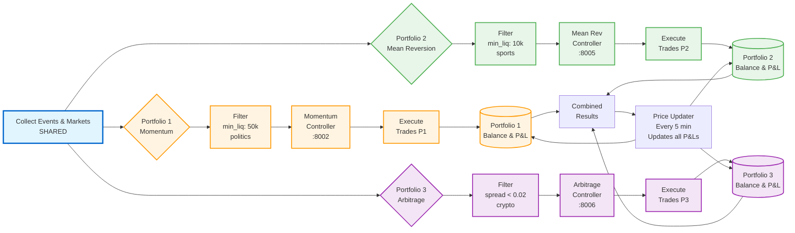
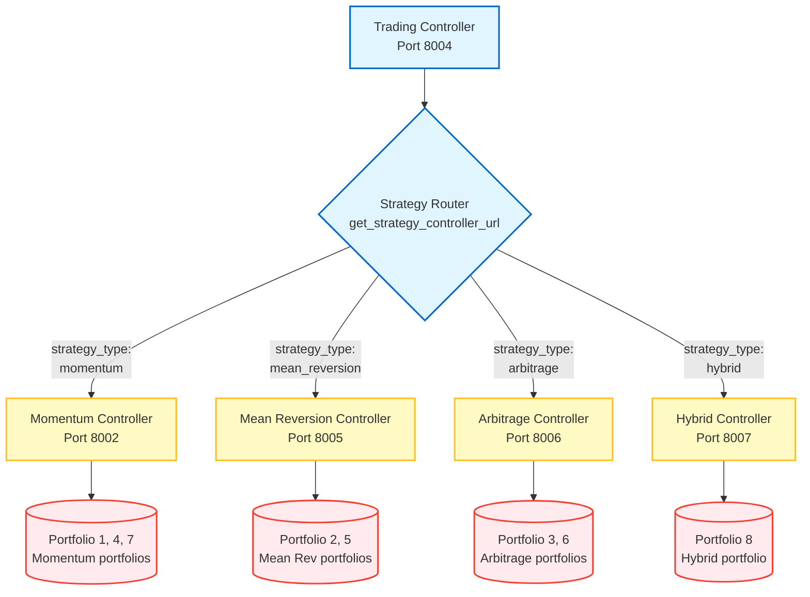
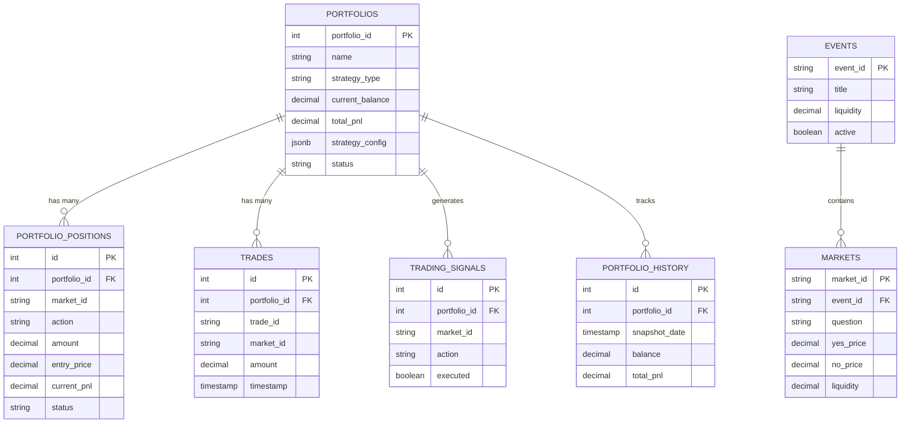

# Prescient OS Code Flow Documentation

This document explains the step-by-step flow of how the Prescient OS trading system works, including the order of controller usage and price updates.

---

## 🔄 System Overview

The Prescient OS is an automated trading system for Polymarket that follows a structured pipeline:
1. **Data Collection** → **Filtering** → **Signal Generation** → **Trade Execution** → **Portfolio Management**
2. **Continuous Price Updates** run in parallel to keep portfolio P&L accurate

---

## 📋 Controller Order and Responsibilities

### 1. Events Controller (Port 8000)
**Purpose**: Fetches and filters events from Polymarket API
**When Used**: First step in trading cycle
**Key Functions**:
- Export all active events from Polymarket
- Filter events based on liquidity, volume, and time criteria
- Store filtered events in `events` table

### 2. Market Controller (Port 8001)
**Purpose**: Fetches and filters individual markets within events
**When Used**: Second step after event filtering
**Key Functions**:
- Export detailed market data for filtered events
- Filter markets based on liquidity, volume, and conviction thresholds
- Store filtered markets in `markets` table

### 3. Trading Strategy Controller (Port 8002)
**Purpose**: Analyzes markets and generates trading signals
**When Used**: Third step after market filtering
**Key Functions**:
- Analyzes filtered markets for trading opportunities
- Generates buy/sell signals with confidence scores
- Stores signals in `trading_signals` table

### 4. Paper Trading Controller (Port 8003)
**Purpose**: Executes virtual trades and manages portfolio
**When Used**: Fourth step for signal execution
**Key Functions**:
- Executes trading signals with virtual money
- Manages portfolio state and positions
- Tracks trade history and P&L
- **Starts and manages the Price Updater**

### 5. Trading Controller (Port 8004)
**Purpose**: Orchestrates the complete trading cycle
**When Used**: Main entry point that coordinates all controllers
**Key Functions**:
- Calls all other controllers in sequence
- Creates portfolio snapshots and archives
- Provides system status and performance summaries

---

## 🔄 Complete Trading Cycle Flow

### Step 1: Event Data Collection
```
Events Controller → /events/export-all-active-events-db
├── Fetches all active events from Polymarket API
├── Stores raw event data in database
└── Returns count of exported events
```

### Step 2: Event Filtering
```
Events Controller → /events/filter-trading-candidates-db
├── Applies liquidity/volume/time filters
├── Stores filtered events in `events` table
└── Returns trading candidate count
```

### Step 3: Market Data Collection
```
Market Controller → /markets/export-filtered-markets-db
├── Fetches detailed market data for filtered events
├── Applies market-specific filters
└── Stores filtered markets in `markets` table
```

### Step 4: Signal Generation
```
Strategy Controller → /strategy/generate-signals
├── Analyzes filtered markets
├── Generates trading signals with confidence scores
└── Stores signals in `trading_signals` table
```

### Step 5: Trade Execution
```
Paper Trading Controller → /paper-trading/execute-signals
├── Loads unexecuted signals from database
├── Executes trades with virtual money
├── Updates portfolio state
├── Records trades in `trades` table
├── Creates positions in `portfolio_positions` table
└── Marks signals as executed
```

### Step 6: Portfolio Snapshot
```
Paper Trading Controller → /paper-trading/portfolio
├── Loads current portfolio state
├── Updates P&L with current market prices
└── Trading Controller creates daily snapshot in `portfolio_history` table
```

### Step 7: Signal Archiving
```
Trading Controller → archive_current_signals()
├── Archives executed signals to `signal_archives` table
└── Cleans up old signals from `trading_signals` table
```

---

## 💰 Price Update Flow (Continuous Background Process)

### Price Updater Initialization
```
Paper Trading Controller Startup
├── Starts Price Updater background thread
├── Sets update interval (default: 5 minutes)
└── Begins continuous price monitoring
```

### Price Update Cycle (Every 5 Minutes)
```
Price Updater → update_open_positions_prices()
├── Step 1: Load open positions from `portfolio_positions` table
├── Step 2: Extract unique market IDs from positions
├── Step 3: Fetch current prices from Polymarket API (batched requests)
├── Step 4: Calculate P&L for each position:
│   ├── Get current price based on action (buy_yes/buy_no)
│   ├── Calculate: P&L = (current_price - entry_price) × amount
│   ├── Update position in `portfolio_positions` table
│   └── Accumulate total P&L
├── Step 5: Update portfolio state:
│   ├── Update `total_profit_loss` in `portfolio_state` table
│   └── Update `last_updated` timestamp
└── Step 6: Store market snapshots:
    └── Insert price data into `market_snapshots` table for history
```

### P&L Calculation Logic
```python
# For each open position:
if action == 'buy_yes':
    current_price = market_data['yes_price']
elif action == 'buy_no':
    current_price = market_data['no_price']

# Calculate position P&L
position_pnl = (current_price - entry_price) * amount

# Update portfolio total P&L
portfolio_total_pnl += position_pnl
```

---

## 🗄️ Database Tables Used in Flow

### During Trading Cycle:
1. **`events`** - Stores filtered trading events
2. **`markets`** - Stores filtered markets with current prices
3. **`trading_signals`** - Stores generated signals before execution
4. **`trades`** - Stores executed trade history (append-only)
5. **`portfolio_positions`** - Stores current open positions
6. **`portfolio_state`** - Stores current portfolio balance and P&L

### During Price Updates:
1. **`portfolio_positions`** - Updated with current P&L
2. **`portfolio_state`** - Updated with total P&L
3. **`market_snapshots`** - New entries created for price history

### For Historical Records:
1. **`portfolio_history`** - Daily portfolio snapshots
2. **`signal_archives`** - Monthly signal archives

---

## ⚡ Real-Time vs Batch Operations

### Real-Time Operations:
- **Price Updates**: Every 5 minutes (background thread)
- **Portfolio P&L**: Updated with each price refresh
- **Market Snapshots**: Created every 5 minutes for active markets

### Batch Operations:
- **Trading Cycle**: Typically run once per day or on-demand
- **Portfolio History**: Created once per day after trading cycle
- **Signal Archives**: Created monthly from old signals

---

## 🔗 API Call Sequence

The Trading Controller orchestrates the following API calls in order:

```python
# 1. Export Events
GET http://localhost:8000/events/export-all-active-events-db

# 2. Filter Events  
GET http://localhost:8000/events/filter-trading-candidates-db?min_liquidity=10000&min_volume=50000

# 3. Filter Markets
GET http://localhost:8001/markets/export-filtered-markets-db?min_liquidity=10000&min_volume=50000

# 4. Generate Signals
GET http://localhost:8002/strategy/generate-signals

# 5. Execute Trades
GET http://localhost:8003/paper-trading/execute-signals

# 6. Get Portfolio (for snapshot)
GET http://localhost:8003/paper-trading/portfolio
```

---

## 🛡️ Error Handling and Recovery

### Price Update Failures:
- Continues running despite individual market price fetch failures
- Logs errors but doesn't stop the background thread
- Skips markets with price parsing errors

### Trading Cycle Failures:
- Stops at first failure point and returns error details
- Previous successful steps remain completed
- Can be restarted from failed step

### Database Connection Issues:
- All controllers handle database connection errors gracefully
- Portfolio operations fail fast if database is unavailable
- Price updater continues trying and logs errors

---

## 📊 Key Metrics Tracked

### Portfolio Metrics:
- **Balance**: Available cash for trading
- **Total Invested**: Money currently in positions
- **Total P&L**: Unrealized profit/loss on open positions
- **Trade Count**: Total number of executed trades

### Performance Metrics:
- **Win Rate**: Percentage of profitable trades
- **Average P&L**: Average profit/loss per trade
- **Portfolio Growth**: Change in total value over time
- **Signal Execution Rate**: Percentage of signals that became trades

---

## 🚀 Starting the System

1. **Start all controllers** in order (ports 8000-8004)
2. **Paper Trading Controller** automatically starts the Price Updater
3. **Run trading cycle** via Trading Controller API
4. **Monitor portfolio** through Paper Trading Controller API
5. **Price updates** continue automatically in background

---

## 🎯 Multi-Portfolio System Flow

### Overview

With multiple portfolios, the system needs to handle different strategies running independently while sharing the same event/market data pool. Here's how it works:

### Key Principle: Shared Data Collection, Portfolio-Specific Filtering

**The Solution:**
1. **Events & Markets tables remain SHARED** - They capture ALL live events/markets from Polymarket
2. **Each portfolio has its own strategy controller** that filters from the shared pool
3. **Filtering happens at signal generation time**, not during data collection
4. **Each portfolio maintains isolated positions, trades, and P&L**

---

### Architecture Changes from Single Portfolio

#### Before (Single Portfolio):
```
Events Controller → Market Controller → Strategy Controller → Paper Trading
     ↓                    ↓                     ↓                    ↓
  Filter all         Filter all         Generate signals      Execute all
  events once        markets once         for system          for system
```

#### After (Multiple Portfolios):
```
Events Controller → Market Controller → [Per-Portfolio Strategy Controllers] → Paper Trading
     ↓                    ↓                           ↓                              ↓
Capture ALL          Capture ALL              Each strategy filters          Execute per
live events         live markets           markets based on its config      portfolio
                                           (stored in portfolio.strategy_config)
```

---

### Detailed Multi-Portfolio Flow

#### Step 1: Shared Data Collection (Same as Before)

**Events Controller (Port 8000)**
```
/events/export-all-active-events-db
├── Fetches ALL active events from Polymarket
├── Stores in shared `events` table
└── NO FILTERING - just raw data collection
```

**Market Controller (Port 8001)**
```
/markets/export-all-markets-db
├── Fetches ALL markets for ALL events
├── Stores in shared `markets` table
└── Applies basic quality filters (e.g., liquidity > $100, not resolved)
```

**Why shared?**
- One portfolio might want high-liquidity markets (>$50k)
- Another portfolio might want low-liquidity arbitrage opportunities (<$10k)
- We capture everything, let each strategy decide what to use

---

#### Step 2: Per-Portfolio Strategy Filtering & Signal Generation

Each portfolio has a `strategy_type` and `strategy_config` that determines which strategy controller to call:

**Portfolio 1**: Momentum Strategy (Port 8002)
```python
{
  "portfolio_id": 1,
  "name": "Aggressive Momentum",
  "strategy_type": "momentum",
  "strategy_config": {
    "min_liquidity": 50000,
    "min_volume": 100000,
    "min_conviction": 0.15,
    "categories": ["politics", "crypto"],
    "max_positions": 20
  }
}
```

**Portfolio 2**: Mean Reversion Strategy (Port 8005)
```python
{
  "portfolio_id": 2,
  "name": "Conservative Mean Reversion",
  "strategy_type": "mean_reversion",
  "strategy_config": {
    "min_liquidity": 10000,
    "min_volume": 20000,
    "extreme_price_threshold": 0.85,
    "categories": ["sports"],
    "max_positions": 10
  }
}
```

**Strategy Controller Endpoints (Updated):**
```
POST /strategy/generate-signals
Body: {
  "portfolio_id": 1
}

Process:
1. Load portfolio config from database
2. Fetch ALL markets from shared `markets` table
3. Apply portfolio-specific filters from strategy_config
4. Run strategy logic on filtered markets
5. Generate signals tagged with portfolio_id
6. Store in `trading_signals` table with portfolio_id
```

---

#### Step 3: Per-Portfolio Trade Execution

**Paper Trading Controller (Port 8003)**
```
/paper-trading/execute-signals?portfolio_id=1

Process:
1. Load portfolio 1's state (balance, positions, limits)
2. Load portfolio 1's unexecuted signals only
3. Check portfolio 1's risk limits (max_exposure, max_positions)
4. Execute trades for portfolio 1
5. Update portfolio 1's balance and positions
6. Mark portfolio 1's signals as executed
```

**Key Isolation:**
- Each portfolio has its own `current_balance`
- Each portfolio has its own `total_invested`
- Each portfolio has its own `max_positions` limit
- Positions are tagged with `portfolio_id`
- Trades are tagged with `portfolio_id`

---

### Complete Multi-Portfolio Trading Cycle

#### Option A: Run All Portfolios Together (Batch Mode)

**Trading Controller Endpoint:**
```
POST /trading/run-all-portfolios

Flow:
1. Collect shared data (events & markets) - ONCE
   └── GET /events/export-all-active-events-db
   └── GET /markets/export-all-markets-db

2. For each active portfolio:
   ├── Get portfolio config (strategy_type, strategy_config)
   ├── Call appropriate strategy controller:
   │   ├── Momentum (8002) if strategy_type = "momentum"
   │   ├── Mean Reversion (8005) if strategy_type = "mean_reversion"
   │   ├── Arbitrage (8006) if strategy_type = "arbitrage"
   │   └── Hybrid (8007) if strategy_type = "hybrid"
   ├── Execute signals for this portfolio
   ├── Update this portfolio's state
   └── Create portfolio snapshot

3. Return summary of all portfolio results
```

**Example API Response:**
```json
{
  "status": "success",
  "portfolios_processed": 3,
  "results": [
    {
      "portfolio_id": 1,
      "portfolio_name": "Aggressive Momentum",
      "signals_generated": 5,
      "trades_executed": 3,
      "new_balance": 9700.00,
      "total_pnl": 150.00
    },
    {
      "portfolio_id": 2,
      "portfolio_name": "Conservative Mean Reversion",
      "signals_generated": 2,
      "trades_executed": 2,
      "new_balance": 9850.00,
      "total_pnl": -50.00
    }
  ]
}
```

#### Option B: Run Individual Portfolio (On-Demand Mode)

**Trading Controller Endpoint:**
```
POST /trading/run-portfolio-cycle
Body: {
  "portfolio_id": 1
}

Flow:
1. Collect shared data (events & markets) - ONCE
2. Run cycle for portfolio 1 only:
   ├── Call momentum strategy controller (based on portfolio's strategy_type)
   ├── Execute signals for portfolio 1
   ├── Update portfolio 1's state
   └── Return portfolio 1's results
```

**Use Cases:**
- Test a new strategy without affecting other portfolios
- Run aggressive portfolio more frequently (hourly)
- Run conservative portfolio less frequently (daily)
- Disable/pause specific portfolios

---

### Strategy Controller Architecture (Option B - Multiple Controllers)

**Port Mapping:**
```
8002 → Momentum Strategy Controller
8005 → Mean Reversion Strategy Controller
8006 → Arbitrage Strategy Controller
8007 → Hybrid Strategy Controller
```

**Each Strategy Controller Has:**
```python
@app.post("/strategy/generate-signals")
async def generate_signals(portfolio_id: int):
    """
    Generate signals for a specific portfolio

    1. Load portfolio config from database
    2. Get strategy_config (filters, params, categories)
    3. Fetch ALL markets from shared markets table
    4. Apply portfolio-specific filters
    5. Run this strategy's logic
    6. Generate signals tagged with portfolio_id
    """

    # Load portfolio
    portfolio = get_portfolio_state(portfolio_id)
    strategy_config = portfolio['strategy_config']

    # Fetch ALL markets from shared pool
    all_markets = get_all_markets()

    # Apply portfolio-specific filters
    filtered_markets = apply_filters(
        markets=all_markets,
        min_liquidity=strategy_config['min_liquidity'],
        min_volume=strategy_config['min_volume'],
        categories=strategy_config.get('categories', [])
    )

    # Run strategy-specific logic
    signals = run_momentum_strategy(
        markets=filtered_markets,
        portfolio=portfolio,
        config=strategy_config
    )

    # Tag signals with portfolio_id and save
    for signal in signals:
        signal['portfolio_id'] = portfolio_id
        save_signal(signal)

    return {"signals_generated": len(signals)}
```

**Trading Controller's Strategy Router:**
```python
def get_strategy_controller_url(strategy_type: str) -> str:
    """Map portfolio strategy type to controller URL"""
    strategy_ports = {
        'momentum': 8002,
        'mean_reversion': 8005,
        'arbitrage': 8006,
        'hybrid': 8007
    }
    port = strategy_ports.get(strategy_type, 8002)
    return f"http://localhost:{port}"

# Usage
portfolio = get_portfolio_state(portfolio_id)
strategy_url = get_strategy_controller_url(portfolio['strategy_type'])
response = requests.post(
    f"{strategy_url}/strategy/generate-signals",
    json={"portfolio_id": portfolio_id}
)
```

---

### Price Update Flow (Multi-Portfolio)

**Price Updater (Background Thread):**
```python
Every 5 minutes:
1. Fetch ALL open positions (across all portfolios)
2. Group by market_id for batch price fetching
3. Fetch current prices from Polymarket (one request per unique market)
4. Update each position's P&L
5. For each portfolio:
   ├── Sum all position P&Ls for this portfolio
   ├── Update portfolio's total_profit_loss
   └── Update portfolio's last_price_update timestamp
```

**Key Change:**
- Instead of updating one portfolio state, loop through all portfolios
- Each portfolio's P&L is calculated independently
- Batch price fetching is shared (efficient)

---

### Database Schema Impact

**New portfolio_id columns added to:**
```sql
-- Each position belongs to a specific portfolio
ALTER TABLE portfolio_positions ADD COLUMN portfolio_id INTEGER REFERENCES portfolios(portfolio_id);

-- Each trade belongs to a specific portfolio
ALTER TABLE trades ADD COLUMN portfolio_id INTEGER REFERENCES portfolios(portfolio_id);

-- Each signal is generated for a specific portfolio
ALTER TABLE trading_signals ADD COLUMN portfolio_id INTEGER REFERENCES portfolios(portfolio_id);

-- Each history snapshot belongs to a specific portfolio
ALTER TABLE portfolio_history ADD COLUMN portfolio_id INTEGER REFERENCES portfolios(portfolio_id);
```

**Shared tables (NO portfolio_id):**
```sql
-- Events table remains shared - all portfolios see all events
CREATE TABLE events (...);

-- Markets table remains shared - all portfolios see all markets
CREATE TABLE markets (...);

-- Market snapshots remain shared - price history for all markets
CREATE TABLE market_snapshots (...);
```

---

### Example: Two Portfolios Running Together

**Setup:**
```sql
-- Portfolio 1: Aggressive Momentum
INSERT INTO portfolios (name, strategy_type, initial_balance, strategy_config)
VALUES ('Aggressive', 'momentum', 10000, '{
  "min_liquidity": 50000,
  "min_conviction": 0.15,
  "categories": ["politics"],
  "max_positions": 20
}');

-- Portfolio 2: Conservative Arbitrage
INSERT INTO portfolios (name, strategy_type, initial_balance, strategy_config)
VALUES ('Conservative', 'arbitrage', 10000, '{
  "min_liquidity": 10000,
  "max_spread": 0.02,
  "categories": ["sports", "crypto"],
  "max_positions": 10
}');
```

**Execution:**
```
1. Trading Controller: POST /trading/run-all-portfolios

2. Data Collection (Shared):
   ├── Events Controller: Fetch 500 events → `events` table
   └── Market Controller: Fetch 2000 markets → `markets` table

3. Portfolio 1 (Aggressive Momentum):
   ├── Filter: min_liquidity=$50k, categories=politics
   │   └── Result: 50 markets match
   ├── Momentum Controller (8002): Generate signals
   │   └── Result: 5 buy signals tagged with portfolio_id=1
   ├── Paper Trading: Execute signals for portfolio_id=1
   │   └── Result: 3 trades executed, balance=$9700
   └── Update portfolios table: portfolio_id=1 state

4. Portfolio 2 (Conservative Arbitrage):
   ├── Filter: min_liquidity=$10k, categories=sports/crypto
   │   └── Result: 200 markets match
   ├── Arbitrage Controller (8006): Generate signals
   │   └── Result: 2 arbitrage signals tagged with portfolio_id=2
   ├── Paper Trading: Execute signals for portfolio_id=2
   │   └── Result: 2 trades executed, balance=$9800
   └── Update portfolios table: portfolio_id=2 state

5. Return combined results
```

**Database State After:**
```sql
-- trading_signals table
| id | portfolio_id | market_id | action   | amount | executed |
|----|--------------|-----------|----------|--------|----------|
| 1  | 1            | mkt_abc   | buy_yes  | 100    | true     |
| 2  | 1            | mkt_def   | buy_yes  | 150    | true     |
| 3  | 1            | mkt_ghi   | buy_no   | 200    | true     |
| 4  | 1            | mkt_jkl   | buy_yes  | 100    | false    | ← insufficient balance
| 5  | 2            | mkt_xyz   | buy_yes  | 100    | true     |
| 6  | 2            | mkt_uvw   | buy_no   | 100    | true     |

-- portfolio_positions table (open positions)
| id | portfolio_id | market_id | action  | amount | entry_price | current_pnl |
|----|--------------|-----------|---------|--------|-------------|-------------|
| 1  | 1            | mkt_abc   | buy_yes | 100    | 0.45        | 5.00        |
| 2  | 1            | mkt_def   | buy_yes | 150    | 0.62        | -10.00      |
| 3  | 1            | mkt_ghi   | buy_no  | 200    | 0.38        | 20.00       |
| 4  | 2            | mkt_xyz   | buy_yes | 100    | 0.51        | 3.00        |
| 5  | 2            | mkt_uvw   | buy_no  | 100    | 0.49        | -5.00       |

-- portfolios table (current state)
| portfolio_id | name         | current_balance | total_invested | total_pnl |
|--------------|--------------|-----------------|----------------|-----------|
| 1            | Aggressive   | 9550.00         | 450.00         | 15.00     |
| 2            | Conservative | 9800.00         | 200.00         | -2.00     |
```

---

### API Endpoints Summary (Multi-Portfolio)

**Trading Controller (Port 8004):**
```
POST /trading/run-all-portfolios
    → Runs complete cycle for all active portfolios

POST /trading/run-portfolio-cycle
    Body: {"portfolio_id": 1}
    → Runs cycle for specific portfolio only

GET /trading/portfolio-summary
    → Returns summary of all portfolios
```

**Strategy Controllers (Ports 8002, 8005, 8006, 8007):**
```
POST /strategy/generate-signals
    Body: {"portfolio_id": 1}
    → Generates signals for specific portfolio
```

**Paper Trading Controller (Port 8003):**
```
GET /paper-trading/execute-signals?portfolio_id=1
    → Executes signals for specific portfolio

GET /paper-trading/portfolio?portfolio_id=1
    → Gets state of specific portfolio

GET /paper-trading/all-portfolios
    → Gets state of all portfolios
```

---

### Benefits of This Architecture

1. **Shared Data Collection**: Efficient - fetch events/markets once for all portfolios
2. **Independent Filtering**: Each portfolio applies its own criteria to shared data pool
3. **True Isolation**: Portfolios can't interfere with each other (separate balance, positions, limits)
4. **Flexible Scheduling**: Run all portfolios together, or run them individually at different intervals
5. **Easy Testing**: Test new strategies on small portfolios without affecting main portfolios
6. **Strategy Diversity**: Mix conservative and aggressive strategies with different risk profiles
7. **Parallel Execution**: Strategy controllers can run in parallel for faster signal generation

---

### Common Use Cases

**Use Case 1: A/B Testing Strategies**
```
Portfolio 1: Momentum (existing strategy)
Portfolio 2: Momentum v2 (new parameters)
→ Run both, compare performance after 30 days
```

**Use Case 2: Risk Diversification**
```
Portfolio 1: $5k - High Risk Momentum (politics, high conviction)
Portfolio 2: $3k - Medium Risk Mean Reversion (sports)
Portfolio 3: $2k - Low Risk Arbitrage (any category, low spreads)
→ Total capital: $10k split across risk profiles
```

**Use Case 3: Category Specialization**
```
Portfolio 1: Politics markets only
Portfolio 2: Sports markets only
Portfolio 3: Crypto markets only
→ Each portfolio becomes expert in its domain
```

**Use Case 4: Frequency Trading**
```
Portfolio 1: Day trading (run every hour, quick in/out)
Portfolio 2: Swing trading (run daily, hold 1-7 days)
Portfolio 3: Position trading (run weekly, hold weeks)
→ Different time horizons, different strategies
```

---

## 📊 Multi-Portfolio System Flow Diagram

```mermaid
graph TD
    Start([Run Multi-Portfolio Trading Cycle]) --> CollectEvents[Events Controller<br/>Port 8000<br/>Collect ALL Events]

    CollectEvents --> CollectMarkets[Market Controller<br/>Port 8001<br/>Collect ALL Markets]

    CollectMarkets --> SharedDB[(Shared Database<br/>events table<br/>markets table)]

    SharedDB --> GetPortfolios{Get All Active<br/>Portfolios}

    GetPortfolios --> P1[Portfolio 1<br/>Aggressive Momentum<br/>strategy_type: momentum]
    GetPortfolios --> P2[Portfolio 2<br/>Conservative Mean Rev<br/>strategy_type: mean_reversion]
    GetPortfolios --> P3[Portfolio 3<br/>Arbitrage Hunter<br/>strategy_type: arbitrage]

    %% Portfolio 1 Flow
    P1 --> P1Config{Load Portfolio Config<br/>min_liquidity: 50k<br/>categories: politics}
    P1Config --> P1Filter[Filter Markets<br/>50 markets match]
    P1Filter --> P1Strategy[Momentum Controller<br/>Port 8002]
    P1Strategy --> P1Signals[Generate 5 Signals<br/>tagged portfolio_id=1]
    P1Signals --> P1Execute[Execute Signals<br/>Check balance & limits]
    P1Execute --> P1Trades[3 Trades Executed<br/>2 Rejected - insufficient balance]
    P1Trades --> P1Update[(Update Portfolio 1<br/>balance: $9700<br/>P&L: +$150)]

    %% Portfolio 2 Flow
    P2 --> P2Config{Load Portfolio Config<br/>min_liquidity: 10k<br/>categories: sports}
    P2Config --> P2Filter[Filter Markets<br/>200 markets match]
    P2Filter --> P2Strategy[Mean Reversion Controller<br/>Port 8005]
    P2Strategy --> P2Signals[Generate 2 Signals<br/>tagged portfolio_id=2]
    P2Signals --> P2Execute[Execute Signals<br/>Check balance & limits]
    P2Execute --> P2Trades[2 Trades Executed]
    P2Trades --> P2Update[(Update Portfolio 2<br/>balance: $9850<br/>P&L: -$50)]

    %% Portfolio 3 Flow
    P3 --> P3Config{Load Portfolio Config<br/>max_spread: 0.02<br/>categories: crypto, sports}
    P3Config --> P3Filter[Filter Markets<br/>150 markets match]
    P3Filter --> P3Strategy[Arbitrage Controller<br/>Port 8006]
    P3Strategy --> P3Signals[Generate 1 Signal<br/>tagged portfolio_id=3]
    P3Signals --> P3Execute[Execute Signals<br/>Check balance & limits]
    P3Execute --> P3Trades[1 Trade Executed]
    P3Trades --> P3Update[(Update Portfolio 3<br/>balance: $9900<br/>P&L: +$25)]

    %% Merge results
    P1Update --> Results[Combine Results]
    P2Update --> Results
    P3Update --> Results

    Results --> Snapshots[Create Portfolio Snapshots<br/>portfolio_history table]

    Snapshots --> PriceUpdater{Price Updater<br/>Background Thread<br/>Every 5 min}

    PriceUpdater --> FetchPositions[Fetch ALL Open Positions<br/>across all portfolios]
    FetchPositions --> GroupMarkets[Group by market_id<br/>Batch fetch prices]
    GroupMarkets --> UpdatePnL[Update Each Position P&L]
    UpdatePnL --> UpdatePortfolios[Update Each Portfolio<br/>total_profit_loss]
    UpdatePortfolios --> PriceUpdater

    Results --> End([Return Summary<br/>3 portfolios processed<br/>6 total trades])

    %% Styling
    classDef shared fill:#e1f5ff,stroke:#0066cc,stroke-width:2px
    classDef portfolio1 fill:#fff4e1,stroke:#ff9800,stroke-width:2px
    classDef portfolio2 fill:#e8f5e9,stroke:#4caf50,stroke-width:2px
    classDef portfolio3 fill:#f3e5f5,stroke:#9c27b0,stroke-width:2px
    classDef strategy fill:#fff9c4,stroke:#fbc02d,stroke-width:2px
    classDef database fill:#ffebee,stroke:#f44336,stroke-width:2px

    class CollectEvents,CollectMarkets,SharedDB shared
    class P1,P1Config,P1Filter,P1Signals,P1Execute,P1Trades,P1Update portfolio1
    class P2,P2Config,P2Filter,P2Signals,P2Execute,P2Trades,P2Update portfolio2
    class P3,P3Config,P3Filter,P3Signals,P3Execute,P3Trades,P3Update portfolio3
    class P1Strategy,P2Strategy,P3Strategy strategy
    class Results,Snapshots,PriceUpdater,FetchPositions,GroupMarkets,UpdatePnL,UpdatePortfolios database
```



### Diagram Legend

**Color Coding:**
- 🔵 **Blue** - Shared data collection (Events & Markets)
- 🟠 **Orange** - Portfolio 1 (Aggressive Momentum) flow
- 🟢 **Green** - Portfolio 2 (Conservative Mean Reversion) flow
- 🟣 **Purple** - Portfolio 3 (Arbitrage Hunter) flow
- 🟡 **Yellow** - Strategy Controllers
- 🔴 **Red** - Database operations & Price Updater

**Key Flow Points:**
1. **Shared Collection** (Top): Events and markets collected once for all portfolios
2. **Parallel Processing** (Middle): Each portfolio runs independently with its own strategy
3. **Isolated Execution** (Bottom): Each portfolio has separate balance, positions, and P&L
4. **Price Updates** (Loop): Continuous background updates for all portfolios

---

## 🔄 Simplified Flow Diagram

For a high-level view, here's a simplified version:



---

## 🎯 Strategy Controller Port Mapping



---

## 📊 Database Schema Relationships



---

*Last Updated: 2025-10-29*
*System Version: 2.0 - Multi-Portfolio Support*